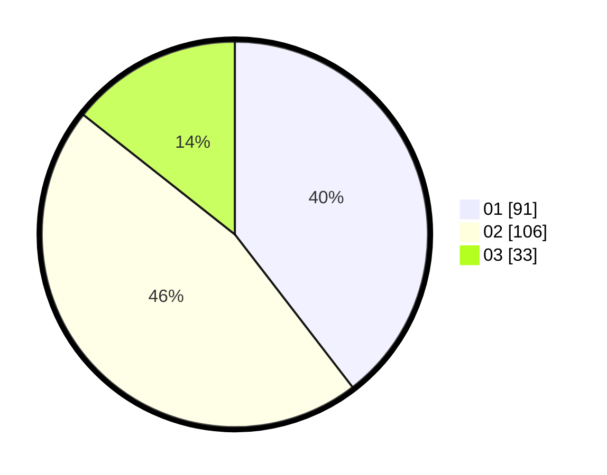

# Hasil

Hasil perolehan suara paslon dapat dilihat pada file paslon-01.txt, paslon-02.txt, dan paslon-03.txt.

Jika tidak ada, artinya data tersebut belum ada pada SIREKAP.

## Perolehan Suara

 * Paslon 01: **91**.
 * Paslon 02: **106**.
 * Paslon 03: **33**.

## Foto C Plano

https://sirekap-obj-formc.kpu.go.id/8b4f/pemilu/ppwp/31/74/09/10/06/3174091006116-20240214-191525--ea24de98-7772-4045-8d7b-d8ddac54aeb6.jpg

https://sirekap-obj-formc.kpu.go.id/8b4f/pemilu/ppwp/31/74/09/10/06/3174091006116-20240214-191528--2930bea0-044f-4c55-8827-c21655265373.jpg

https://sirekap-obj-formc.kpu.go.id/8b4f/pemilu/ppwp/31/74/09/10/06/3174091006116-20240214-191539--4a5ba7ee-98ab-4387-86cc-3ecda42aefac.jpg

## DATA PEMILIH TETAP

Jumlah pemilih dalam DPT: **300**.
 * L: **141**.
 * P: **159**.

## DATA PENGGUNA HAK PILIH

Jumlah pengguna hak pilih dalam DPT: **234**.
 * L: **106**.
 * P: **128**.

Jumlah pengguna hak pilih dalam DPTb: **0**.
 * L: **0**.
 * P: **0**.

Jumlah pengguna hak pilih dalam DPK: **2**.
 * L: **1**.
 * P: **1**.

Jumlah pengguna hak pilih: **236**.
 * L: **107**.
 * P: **129**.

## JUMLAH SUARA SAH DAN TIDAK SAH

JUMLAH SELURUH SUARA SAH: **230**.

JUMLAH SUARA TIDAK SAH: **6**.

JUMLAH SELURUH SUARA SAH DAN SUARA TIDAK SAH: **236**.
