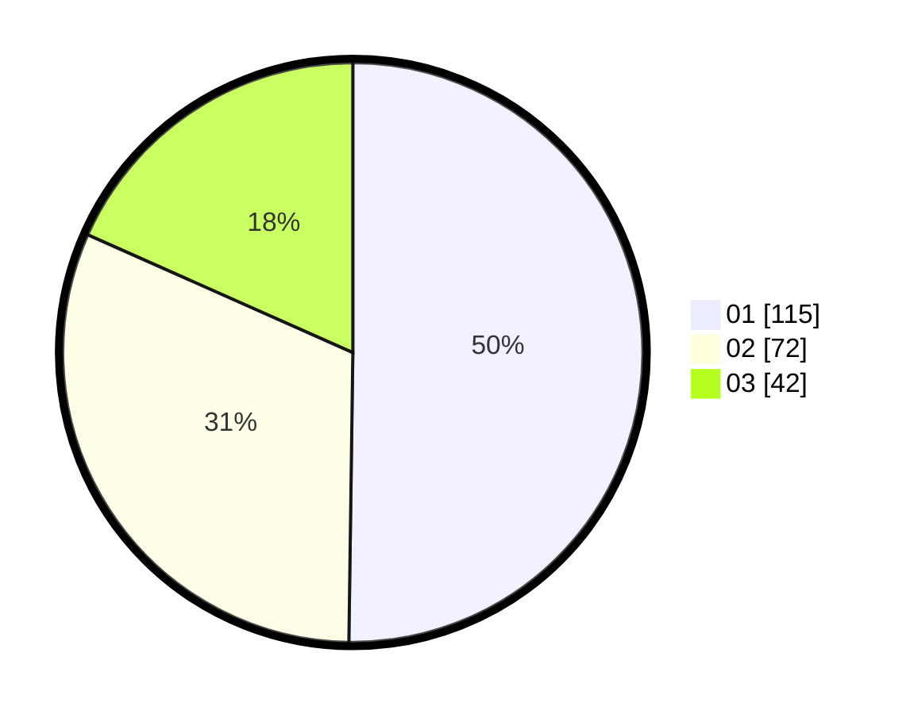

# Hasil

Hasil perolehan suara paslon dapat dilihat pada file paslon-01.txt, paslon-02.txt, dan paslon-03.txt.

Jika tidak ada, artinya data tersebut belum ada pada SIREKAP.

## Perolehan Suara

 * Paslon 01: **115**.
 * Paslon 02: **72**.
 * Paslon 03: **42**.

## Foto C Plano

https://sirekap-obj-formc.kpu.go.id/126d/pemilu/ppwp/31/74/09/10/06/3174091006119-20240214-225532--8cbc97cb-95da-4aee-868d-c2fc10b0263e.jpg

https://sirekap-obj-formc.kpu.go.id/126d/pemilu/ppwp/31/74/09/10/06/3174091006119-20240215-122227--834dfc00-6a7e-4349-b364-9290faa1da96.jpg

https://sirekap-obj-formc.kpu.go.id/126d/pemilu/ppwp/31/74/09/10/06/3174091006119-20240214-225930--7a23ea15-7e2a-4aa8-9e7d-e5e35e091747.jpg

## DATA PEMILIH TETAP

Jumlah pemilih dalam DPT: **271**.
 * L: **139**.
 * P: **132**.

## DATA PENGGUNA HAK PILIH

Jumlah pengguna hak pilih dalam DPT: **226**.
 * L: **108**.
 * P: **118**.

Jumlah pengguna hak pilih dalam DPTb: **6**.
 * L: **4**.
 * P: **2**.

Jumlah pengguna hak pilih dalam DPK: **3**.
 * L: **1**.
 * P: **2**.

Jumlah pengguna hak pilih: **235**.
 * L: **113**.
 * P: **122**.

## JUMLAH SUARA SAH DAN TIDAK SAH

JUMLAH SELURUH SUARA SAH: **229**.

JUMLAH SUARA TIDAK SAH: **6**.

JUMLAH SELURUH SUARA SAH DAN SUARA TIDAK SAH: **235**.
