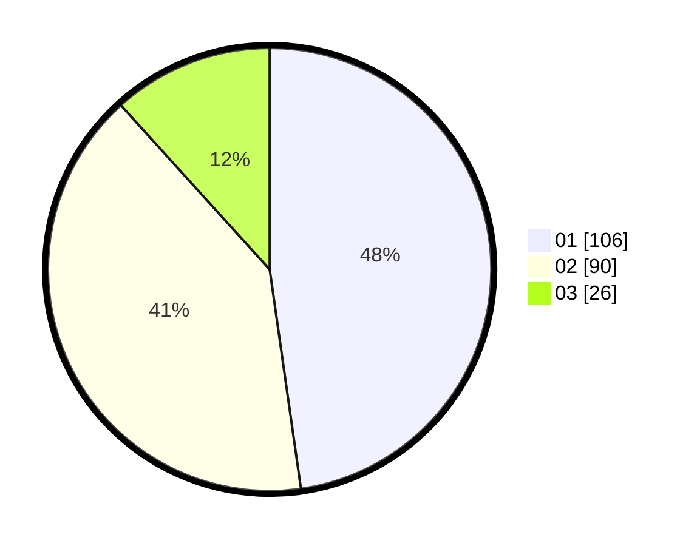

# Hasil

Hasil perolehan suara paslon dapat dilihat pada file paslon-01.txt, paslon-02.txt, dan paslon-03.txt.

Jika tidak ada, artinya data tersebut belum ada pada SIREKAP.

## Perolehan Suara

 * Paslon 01: **106**.
 * Paslon 02: **90**.
 * Paslon 03: **26**.

## Foto C Plano

https://sirekap-obj-formc.kpu.go.id/dbe8/pemilu/ppwp/31/74/09/10/06/3174091006123-20240214-155546--b07e6070-0949-4ec2-bd38-7416edea9f3b.jpg

https://sirekap-obj-formc.kpu.go.id/dbe8/pemilu/ppwp/31/74/09/10/06/3174091006123-20240214-155749--a89b0b31-c397-4de7-85d7-3d9839d312d8.jpg

https://sirekap-obj-formc.kpu.go.id/dbe8/pemilu/ppwp/31/74/09/10/06/3174091006123-20240214-160103--0d1fc41b-f17a-42dc-a04d-4979d07938d0.jpg

## DATA PEMILIH TETAP

Jumlah pemilih dalam DPT: **262**.
 * L: **128**.
 * P: **134**.

## DATA PENGGUNA HAK PILIH

Jumlah pengguna hak pilih dalam DPT: **222**.
 * L: **104**.
 * P: **118**.

Jumlah pengguna hak pilih dalam DPTb: **0**.
 * L: **0**.
 * P: **0**.

Jumlah pengguna hak pilih dalam DPK: **1**.
 * L: **0**.
 * P: **1**.

Jumlah pengguna hak pilih: **223**.
 * L: **104**.
 * P: **119**.

## JUMLAH SUARA SAH DAN TIDAK SAH

JUMLAH SELURUH SUARA SAH: **222**.

JUMLAH SUARA TIDAK SAH: **1**.

JUMLAH SELURUH SUARA SAH DAN SUARA TIDAK SAH: **223**.
