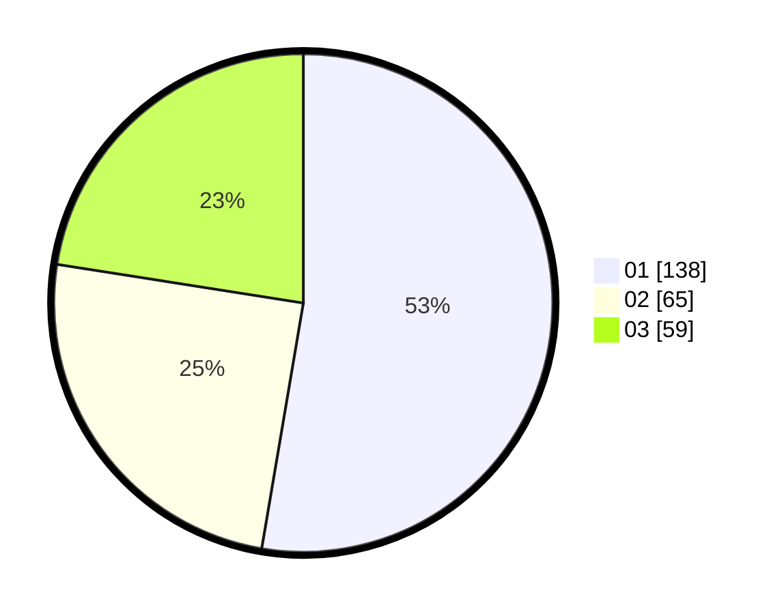

# Hasil

Hasil perolehan suara paslon dapat dilihat pada file paslon-01.txt, paslon-02.txt, dan paslon-03.txt.

Jika tidak ada, artinya data tersebut belum ada pada SIREKAP.

## Perolehan Suara

 * Paslon 01: **138**.
 * Paslon 02: **65**.
 * Paslon 03: **59**.

## Foto C Plano

https://sirekap-obj-formc.kpu.go.id/7851/pemilu/ppwp/31/74/09/10/06/3174091006129-20240214-224239--e1c0231b-0274-4bde-8a32-6746fdbfffef.jpg

https://sirekap-obj-formc.kpu.go.id/7851/pemilu/ppwp/31/74/09/10/06/3174091006129-20240214-224321--2b781fd2-a2bf-4942-b38b-88a552412697.jpg

https://sirekap-obj-formc.kpu.go.id/7851/pemilu/ppwp/31/74/09/10/06/3174091006129-20240214-224406--a05fa871-ec01-4665-9a8d-77bca87da716.jpg

## DATA PEMILIH TETAP

Jumlah pemilih dalam DPT: **279**.
 * L: **132**.
 * P: **147**.

## DATA PENGGUNA HAK PILIH

Jumlah pengguna hak pilih dalam DPT: **254**.
 * L: **119**.
 * P: **135**.

Jumlah pengguna hak pilih dalam DPTb: **14**.
 * L: **3**.
 * P: **11**.

Jumlah pengguna hak pilih dalam DPK: **2**.
 * L: **1**.
 * P: **1**.

Jumlah pengguna hak pilih: **270**.
 * L: **123**.
 * P: **147**.

## JUMLAH SUARA SAH DAN TIDAK SAH

JUMLAH SELURUH SUARA SAH: **262**.

JUMLAH SUARA TIDAK SAH: **8**.

JUMLAH SELURUH SUARA SAH DAN SUARA TIDAK SAH: **270**.
