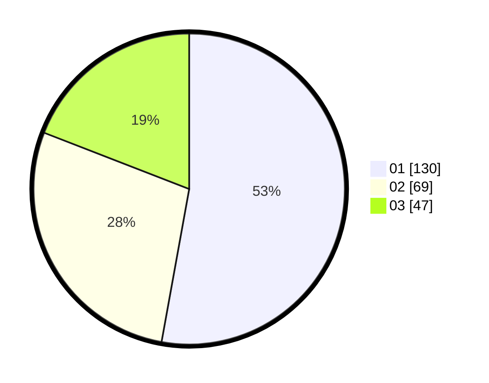

# Hasil

Hasil perolehan suara paslon dapat dilihat pada file paslon-01.txt, paslon-02.txt, dan paslon-03.txt.

Jika tidak ada, artinya data tersebut belum ada pada SIREKAP.

## Perolehan Suara

 * Paslon 01: **130**.
 * Paslon 02: **69**.
 * Paslon 03: **47**.

## Foto C Plano

https://sirekap-obj-formc.kpu.go.id/7666/pemilu/ppwp/31/74/09/10/06/3174091006134-20240214-155130--d2b77b49-6036-4bfe-bcb0-3b60e12b7892.jpg

https://sirekap-obj-formc.kpu.go.id/7666/pemilu/ppwp/31/74/09/10/06/3174091006134-20240214-162243--4b63a470-3f36-462e-8151-960ce32d2c30.jpg

https://sirekap-obj-formc.kpu.go.id/7666/pemilu/ppwp/31/74/09/10/06/3174091006134-20240214-155207--f9bb7619-df41-44c2-b7d5-d4b355cf1311.jpg

## DATA PEMILIH TETAP

Jumlah pemilih dalam DPT: **276**.
 * L: **131**.
 * P: **145**.

## DATA PENGGUNA HAK PILIH

Jumlah pengguna hak pilih dalam DPT: **225**.
 * L: **105**.
 * P: **120**.

Jumlah pengguna hak pilih dalam DPTb: **21**.
 * L: **3**.
 * P: **18**.

Jumlah pengguna hak pilih dalam DPK: **5**.
 * L: **3**.
 * P: **2**.

Jumlah pengguna hak pilih: **251**.
 * L: **111**.
 * P: **140**.

## JUMLAH SUARA SAH DAN TIDAK SAH

JUMLAH SELURUH SUARA SAH: **246**.

JUMLAH SUARA TIDAK SAH: **5**.

JUMLAH SELURUH SUARA SAH DAN SUARA TIDAK SAH: **251**.
