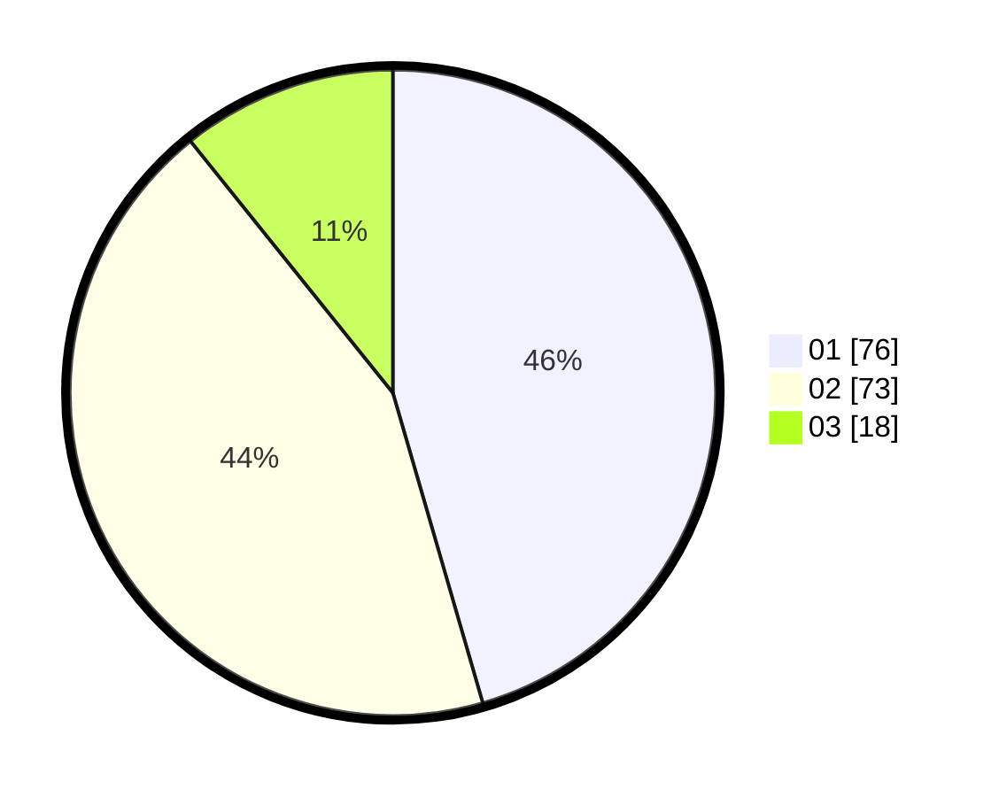

# Hasil

Hasil perolehan suara paslon dapat dilihat pada file paslon-01.txt, paslon-02.txt, dan paslon-03.txt.

Jika tidak ada, artinya data tersebut belum ada pada SIREKAP.

## Perolehan Suara

 * Paslon 01: **76**.
 * Paslon 02: **73**.
 * Paslon 03: **18**.

## Foto C Plano

https://sirekap-obj-formc.kpu.go.id/caad/pemilu/ppwp/31/74/10/10/01/3174101001007-20240214-212930--9b0f29e6-f8b1-451c-a969-8906dea2a556.jpg

https://sirekap-obj-formc.kpu.go.id/caad/pemilu/ppwp/31/74/10/10/01/3174101001007-20240214-213227--95fc8d15-ac10-4665-a69e-8bdbb96c1dfc.jpg

https://sirekap-obj-formc.kpu.go.id/caad/pemilu/ppwp/31/74/10/10/01/3174101001007-20240214-213406--57d8c981-a8a4-4299-bcc5-47d28e74691b.jpg
