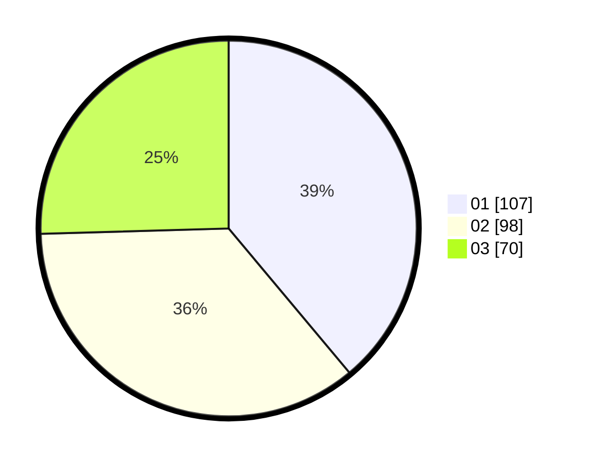

# Hasil

Hasil perolehan suara paslon dapat dilihat pada file paslon-01.txt, paslon-02.txt, dan paslon-03.txt.

Jika tidak ada, artinya data tersebut belum ada pada SIREKAP.

## Perolehan Suara

 * Paslon 01: **107**.
 * Paslon 02: **98**.
 * Paslon 03: **70**.

## Foto C Plano

https://sirekap-obj-formc.kpu.go.id/90e3/pemilu/ppwp/31/74/10/10/01/3174101001040-20240214-202212--c27c081d-b6ca-455d-ad6b-e27cf82f52ed.jpg

https://sirekap-obj-formc.kpu.go.id/90e3/pemilu/ppwp/31/74/10/10/01/3174101001040-20240214-202508--a0b51ae8-a1fc-4e81-bba9-fcc420d6a018.jpg

https://sirekap-obj-formc.kpu.go.id/90e3/pemilu/ppwp/31/74/10/10/01/3174101001040-20240214-202609--181ec652-3a84-4134-b076-5c66b35fa589.jpg

## DATA PEMILIH TETAP

Jumlah pemilih dalam DPT: **293**.
 * L: **147**.
 * P: **146**.

## DATA PENGGUNA HAK PILIH

Jumlah pengguna hak pilih dalam DPT: **236**.
 * L: **110**.
 * P: **126**.

Jumlah pengguna hak pilih dalam DPTb: **4**.
 * L: **3**.
 * P: **1**.

Jumlah pengguna hak pilih dalam DPK: **1**.
 * L: **1**.
 * P: **0**.

Jumlah pengguna hak pilih: **241**.
 * L: **114**.
 * P: **127**.

## JUMLAH SUARA SAH DAN TIDAK SAH

JUMLAH SELURUH SUARA SAH: **235**.

JUMLAH SUARA TIDAK SAH: **6**.

JUMLAH SELURUH SUARA SAH DAN SUARA TIDAK SAH: **241**.
