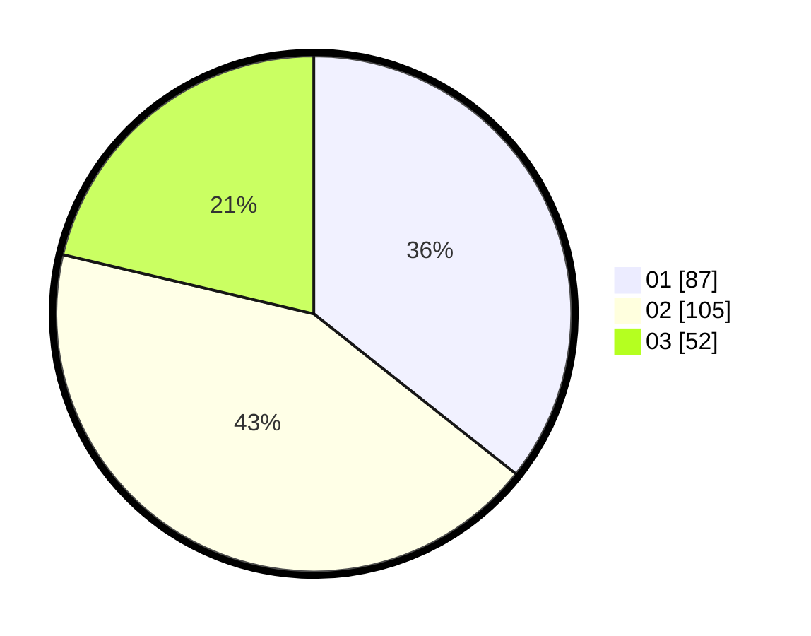

# Hasil

Hasil perolehan suara paslon dapat dilihat pada file paslon-01.txt, paslon-02.txt, dan paslon-03.txt.

Jika tidak ada, artinya data tersebut belum ada pada SIREKAP.

## Perolehan Suara

 * Paslon 01: **87**.
 * Paslon 02: **105**.
 * Paslon 03: **52**.

## Foto C Plano

https://sirekap-obj-formc.kpu.go.id/e994/pemilu/ppwp/31/74/10/10/01/3174101001045-20240214-211932--8e266362-ef51-4a0b-ac92-0eddfd4fa710.jpg

https://sirekap-obj-formc.kpu.go.id/e994/pemilu/ppwp/31/74/10/10/01/3174101001045-20240214-212055--00246906-ea9a-4db9-9092-8d5473e21a44.jpg

https://sirekap-obj-formc.kpu.go.id/e994/pemilu/ppwp/31/74/10/10/01/3174101001045-20240214-212143--029e7fbf-4b8c-4d0b-bec0-2877d45d5836.jpg

## DATA PEMILIH TETAP

Jumlah pemilih dalam DPT: **290**.
 * L: **140**.
 * P: **150**.

## DATA PENGGUNA HAK PILIH

Jumlah pengguna hak pilih dalam DPT: **214**.
 * L: **100**.
 * P: **114**.

Jumlah pengguna hak pilih dalam DPTb: **20**.
 * L: **6**.
 * P: **14**.

Jumlah pengguna hak pilih dalam DPK: **12**.
 * L: **5**.
 * P: **7**.

Jumlah pengguna hak pilih: **246**.
 * L: **111**.
 * P: **135**.

## JUMLAH SUARA SAH DAN TIDAK SAH

JUMLAH SELURUH SUARA SAH: **244**.

JUMLAH SUARA TIDAK SAH: **2**.

JUMLAH SELURUH SUARA SAH DAN SUARA TIDAK SAH: **246**.
