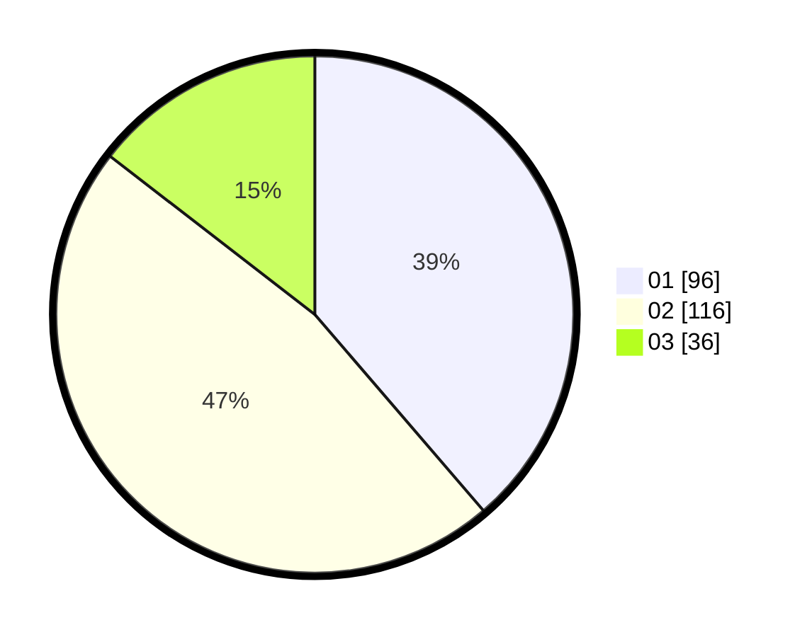

# Hasil

Hasil perolehan suara paslon dapat dilihat pada file paslon-01.txt, paslon-02.txt, dan paslon-03.txt.

Jika tidak ada, artinya data tersebut belum ada pada SIREKAP.

## Perolehan Suara

 * Paslon 01: **96**.
 * Paslon 02: **116**.
 * Paslon 03: **36**.

## Foto C Plano

https://sirekap-obj-formc.kpu.go.id/ae8b/pemilu/ppwp/31/74/10/10/01/3174101001047-20240214-190428--18a4d314-1bf8-43a9-8b0e-674aecc451b2.jpg

https://sirekap-obj-formc.kpu.go.id/ae8b/pemilu/ppwp/31/74/10/10/01/3174101001047-20240214-190936--34868e69-3b49-4107-b699-affea04505a6.jpg

https://sirekap-obj-formc.kpu.go.id/ae8b/pemilu/ppwp/31/74/10/10/01/3174101001047-20240214-191008--e3cfb453-fb38-464c-8718-8126ed2796e4.jpg

## DATA PEMILIH TETAP

Jumlah pemilih dalam DPT: **299**.
 * L: **152**.
 * P: **147**.

## DATA PENGGUNA HAK PILIH

Jumlah pengguna hak pilih dalam DPT: **231**.
 * L: **111**.
 * P: **120**.

Jumlah pengguna hak pilih dalam DPTb: **2**.
 * L: **0**.
 * P: **2**.

Jumlah pengguna hak pilih dalam DPK: **1**.
 * L: **1**.
 * P: **0**.

Jumlah pengguna hak pilih: **234**.
 * L: **111**.
 * P: **122**.

## JUMLAH SUARA SAH DAN TIDAK SAH

JUMLAH SELURUH SUARA SAH: **248**.

JUMLAH SUARA TIDAK SAH: **5**.

JUMLAH SELURUH SUARA SAH DAN SUARA TIDAK SAH: **253**.
