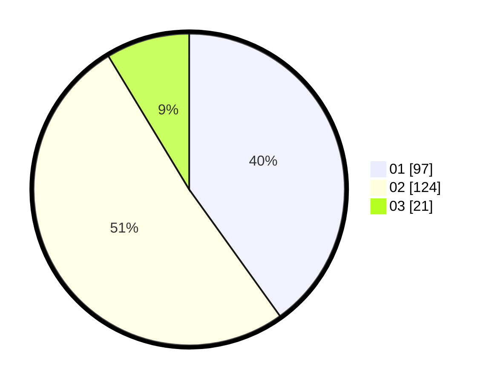

# Hasil

Hasil perolehan suara paslon dapat dilihat pada file paslon-01.txt, paslon-02.txt, dan paslon-03.txt.

Jika tidak ada, artinya data tersebut belum ada pada SIREKAP.

## Perolehan Suara

 * Paslon 01: **97**.
 * Paslon 02: **124**.
 * Paslon 03: **21**.

## Foto C Plano

https://sirekap-obj-formc.kpu.go.id/e722/pemilu/ppwp/31/74/10/10/01/3174101001049-20240214-195816--eaecfde3-e102-484f-abce-8e66a3890e35.jpg

https://sirekap-obj-formc.kpu.go.id/e722/pemilu/ppwp/31/74/10/10/01/3174101001049-20240214-200129--0358a4cc-bd86-41d9-aa2d-16d69e2e2748.jpg

https://sirekap-obj-formc.kpu.go.id/e722/pemilu/ppwp/31/74/10/10/01/3174101001049-20240214-210325--fc721b54-913c-4d53-b601-a1e0e7d9aa4e.jpg
