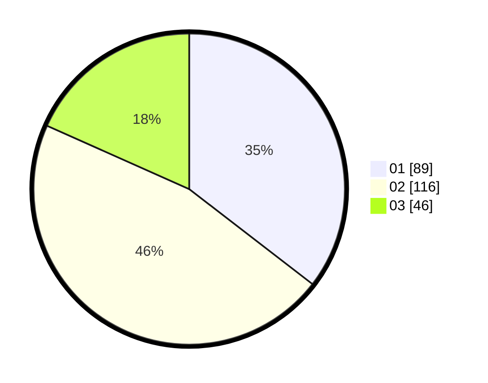

# Hasil

Hasil perolehan suara paslon dapat dilihat pada file paslon-01.txt, paslon-02.txt, dan paslon-03.txt.

Jika tidak ada, artinya data tersebut belum ada pada SIREKAP.

## Perolehan Suara

 * Paslon 01: **89**.
 * Paslon 02: **116**.
 * Paslon 03: **46**.

## Foto C Plano

https://sirekap-obj-formc.kpu.go.id/876c/pemilu/ppwp/31/74/10/10/01/3174101001051-20240214-203927--d750909e-26d2-4ef6-b5eb-4600238dad6f.jpg

https://sirekap-obj-formc.kpu.go.id/876c/pemilu/ppwp/31/74/10/10/01/3174101001051-20240214-205304--2e73b4ad-2fbe-4c3b-8aca-63fc0ec4d85c.jpg

https://sirekap-obj-formc.kpu.go.id/876c/pemilu/ppwp/31/74/10/10/01/3174101001051-20240214-205056--3f85fa80-5121-40aa-92fc-19b5330132a7.jpg

## DATA PEMILIH TETAP

Jumlah pemilih dalam DPT: **298**.
 * L: **135**.
 * P: **163**.

## DATA PENGGUNA HAK PILIH

Jumlah pengguna hak pilih dalam DPT: **245**.
 * L: **106**.
 * P: **139**.

Jumlah pengguna hak pilih dalam DPTb: **4**.
 * L: **1**.
 * P: **3**.

Jumlah pengguna hak pilih dalam DPK: **4**.
 * L: **0**.
 * P: **4**.

Jumlah pengguna hak pilih: **253**.
 * L: **107**.
 * P: **146**.

## JUMLAH SUARA SAH DAN TIDAK SAH

JUMLAH SELURUH SUARA SAH: **251**.

JUMLAH SUARA TIDAK SAH: **2**.

JUMLAH SELURUH SUARA SAH DAN SUARA TIDAK SAH: **253**.
