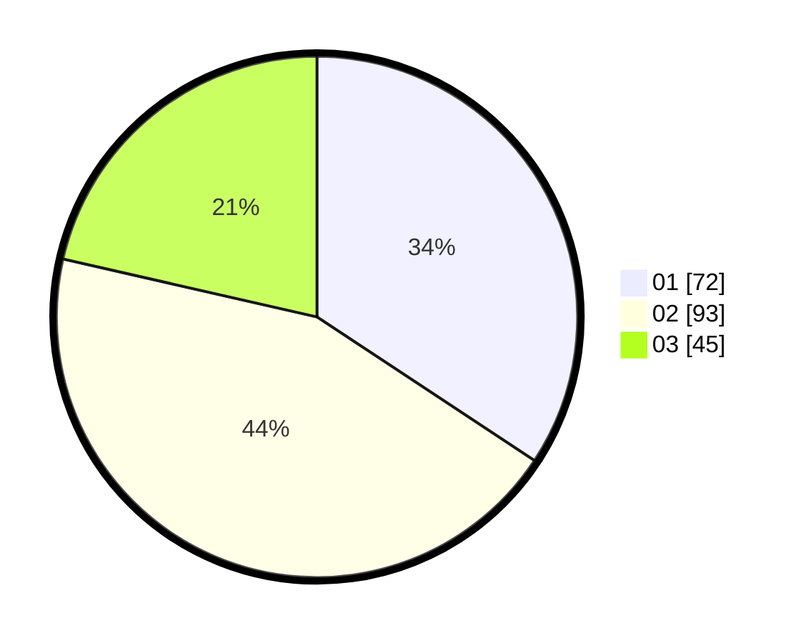

# Hasil

Hasil perolehan suara paslon dapat dilihat pada file paslon-01.txt, paslon-02.txt, dan paslon-03.txt.

Jika tidak ada, artinya data tersebut belum ada pada SIREKAP.

## Perolehan Suara

 * Paslon 01: **72**.
 * Paslon 02: **93**.
 * Paslon 03: **45**.

## Foto C Plano

https://sirekap-obj-formc.kpu.go.id/c2ff/pemilu/ppwp/31/74/10/10/01/3174101001082-20240214-203408--70fc0070-c3d1-4958-ad0c-da5a24f05816.jpg

https://sirekap-obj-formc.kpu.go.id/c2ff/pemilu/ppwp/31/74/10/10/01/3174101001082-20240214-220505--2ae912d5-52b7-402f-b8f5-0bdfbc4ff1ad.jpg

https://sirekap-obj-formc.kpu.go.id/c2ff/pemilu/ppwp/31/74/10/10/01/3174101001082-20240214-204332--313da852-5d0e-4452-9837-85030623ab1e.jpg

## DATA PEMILIH TETAP

Jumlah pemilih dalam DPT: **250**.
 * L: **121**.
 * P: **129**.

## DATA PENGGUNA HAK PILIH

Jumlah pengguna hak pilih dalam DPT: **210**.
 * L: **98**.
 * P: **112**.

Jumlah pengguna hak pilih dalam DPTb: **0**.
 * L: **0**.
 * P: **0**.

Jumlah pengguna hak pilih dalam DPK: **3**.
 * L: **1**.
 * P: **2**.

Jumlah pengguna hak pilih: **213**.
 * L: **99**.
 * P: **114**.

## JUMLAH SUARA SAH DAN TIDAK SAH

JUMLAH SELURUH SUARA SAH: **210**.

JUMLAH SUARA TIDAK SAH: **3**.

JUMLAH SELURUH SUARA SAH DAN SUARA TIDAK SAH: **213**.
