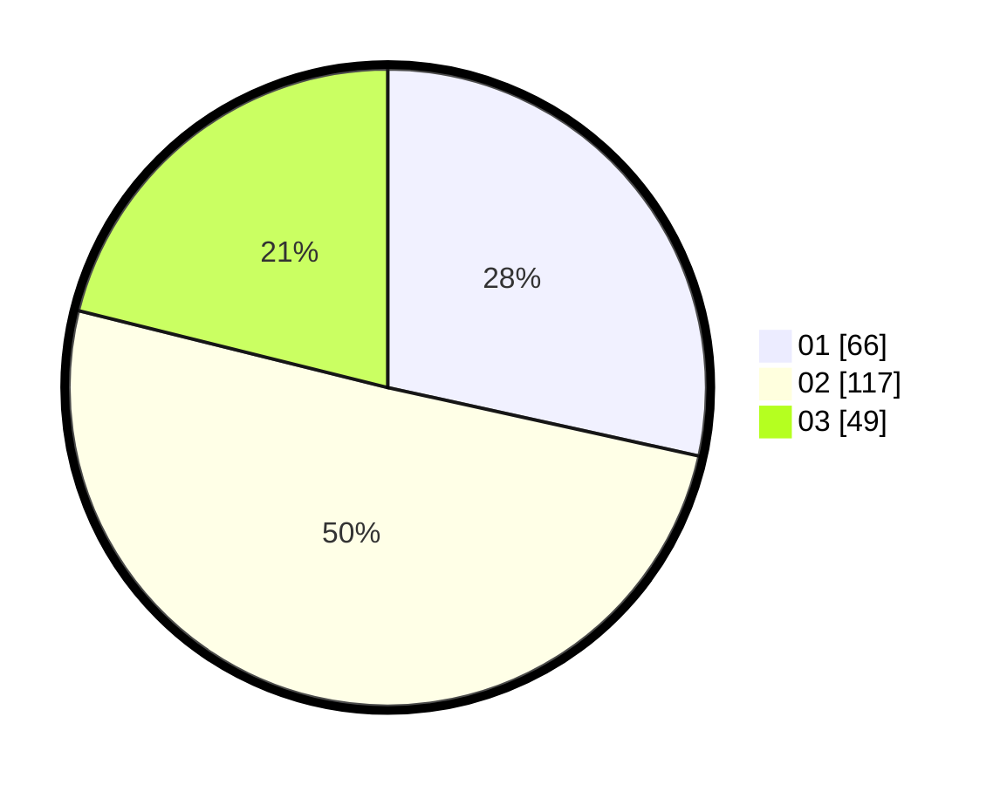

# Hasil

Hasil perolehan suara paslon dapat dilihat pada file paslon-01.txt, paslon-02.txt, dan paslon-03.txt.

Jika tidak ada, artinya data tersebut belum ada pada SIREKAP.

## Perolehan Suara

 * Paslon 01: **66**.
 * Paslon 02: **117**.
 * Paslon 03: **49**.

## Foto C Plano

https://sirekap-obj-formc.kpu.go.id/9e31/pemilu/ppwp/31/74/10/10/01/3174101001091-20240214-141002--faddf6f0-f23e-428a-9666-742c90ec43ed.jpg

https://sirekap-obj-formc.kpu.go.id/9e31/pemilu/ppwp/31/74/10/10/01/3174101001091-20240214-141357--a203f6c0-bd48-4069-947f-0b4a0b7b1d7b.jpg

https://sirekap-obj-formc.kpu.go.id/9e31/pemilu/ppwp/31/74/10/10/01/3174101001091-20240214-141244--9a4343f6-150a-47cb-a311-a8a4f9849749.jpg

## DATA PEMILIH TETAP

Jumlah pemilih dalam DPT: **266**.
 * L: **127**.
 * P: **139**.

## DATA PENGGUNA HAK PILIH

Jumlah pengguna hak pilih dalam DPT: **235**.
 * L: **109**.
 * P: **126**.

Jumlah pengguna hak pilih dalam DPTb: **1**.
 * L: **1**.
 * P: **0**.

Jumlah pengguna hak pilih dalam DPK: **0**.
 * L: **0**.
 * P: **0**.

Jumlah pengguna hak pilih: **236**.
 * L: **110**.
 * P: **126**.

## JUMLAH SUARA SAH DAN TIDAK SAH

JUMLAH SELURUH SUARA SAH: **232**.

JUMLAH SUARA TIDAK SAH: **4**.

JUMLAH SELURUH SUARA SAH DAN SUARA TIDAK SAH: **236**.
