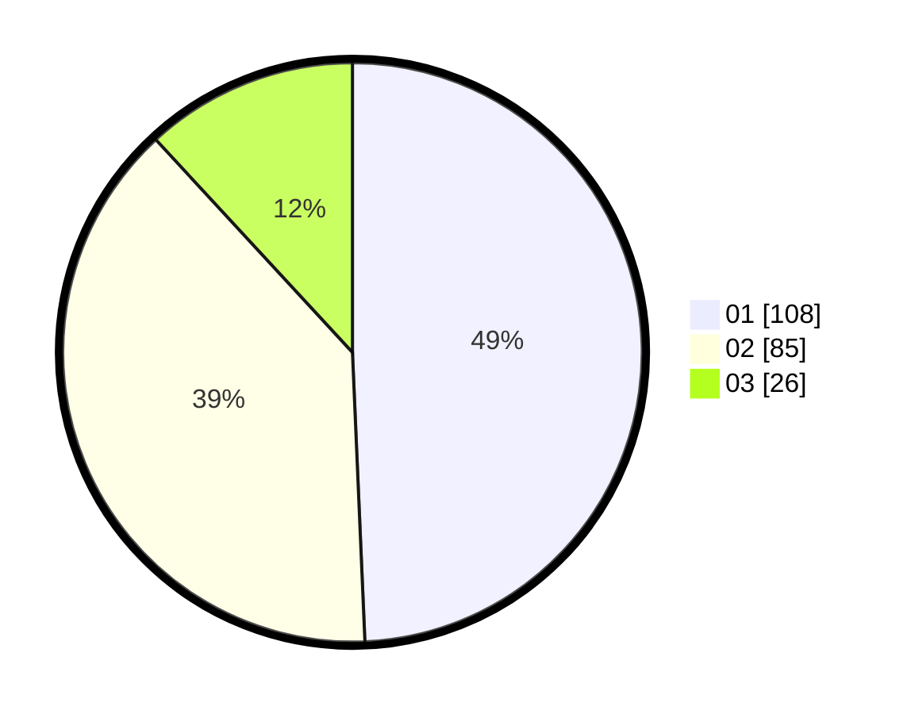

# Hasil

Hasil perolehan suara paslon dapat dilihat pada file paslon-01.txt, paslon-02.txt, dan paslon-03.txt.

Jika tidak ada, artinya data tersebut belum ada pada SIREKAP.

## Perolehan Suara

 * Paslon 01: **108**.
 * Paslon 02: **85**.
 * Paslon 03: **26**.

## Foto C Plano

https://sirekap-obj-formc.kpu.go.id/b0db/pemilu/ppwp/31/74/10/10/02/3174101002011-20240215-205733--7b5df2ba-b651-4e3b-b1ae-64e67614c3aa.jpg

https://sirekap-obj-formc.kpu.go.id/b0db/pemilu/ppwp/31/74/10/10/02/3174101002011-20240215-205736--8e7f8404-0edc-4e26-8d52-31f3c277ce92.jpg

https://sirekap-obj-formc.kpu.go.id/b0db/pemilu/ppwp/31/74/10/10/02/3174101002011-20240215-205734--a0e4d4dd-66ed-4dc8-9ae6-d54a3b8c158a.jpg

## DATA PEMILIH TETAP

Jumlah pemilih dalam DPT: **265**.
 * L: **134**.
 * P: **131**.

## DATA PENGGUNA HAK PILIH

Jumlah pengguna hak pilih dalam DPT: **221**.
 * L: **106**.
 * P: **115**.

Jumlah pengguna hak pilih dalam DPTb: **2**.
 * L: **1**.
 * P: **1**.

Jumlah pengguna hak pilih dalam DPK: **0**.
 * L: **0**.
 * P: **0**.

Jumlah pengguna hak pilih: **223**.
 * L: **107**.
 * P: **116**.

## JUMLAH SUARA SAH DAN TIDAK SAH

JUMLAH SELURUH SUARA SAH: **219**.

JUMLAH SUARA TIDAK SAH: **4**.

JUMLAH SELURUH SUARA SAH DAN SUARA TIDAK SAH: **223**.
