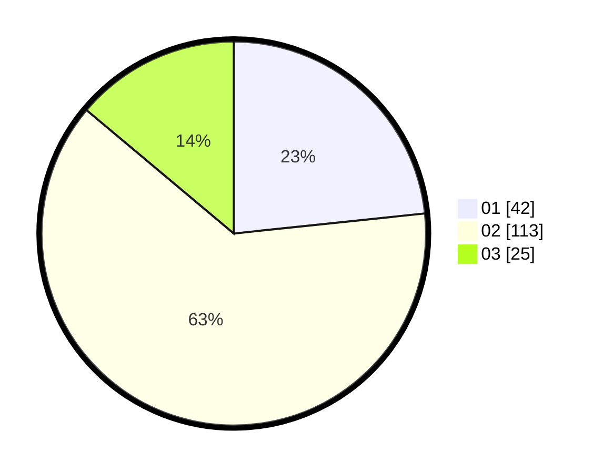

# Hasil

Hasil perolehan suara paslon dapat dilihat pada file paslon-01.txt, paslon-02.txt, dan paslon-03.txt.

Jika tidak ada, artinya data tersebut belum ada pada SIREKAP.

## Perolehan Suara

 * Paslon 01: **42**.
 * Paslon 02: **113**.
 * Paslon 03: **25**.

## Foto C Plano

https://sirekap-obj-formc.kpu.go.id/509a/pemilu/ppwp/31/74/10/10/02/3174101002022-20240216-175912--2de4ab2a-8dc2-40e5-9c09-6ea6713552ac.jpg

https://sirekap-obj-formc.kpu.go.id/509a/pemilu/ppwp/31/74/10/10/02/3174101002022-20240216-175914--f87fa705-bfef-4726-9e3f-78f9a6106426.jpg

https://sirekap-obj-formc.kpu.go.id/509a/pemilu/ppwp/31/74/10/10/02/3174101002022-20240216-175913--758d0bbf-2e62-4c0a-be2c-fb2932c22411.jpg

## DATA PEMILIH TETAP

Jumlah pemilih dalam DPT: **225**.
 * L: **107**.
 * P: **118**.

## DATA PENGGUNA HAK PILIH

Jumlah pengguna hak pilih dalam DPT: **179**.
 * L: **82**.
 * P: **97**.

Jumlah pengguna hak pilih dalam DPTb: **5**.
 * L: **1**.
 * P: **4**.

Jumlah pengguna hak pilih dalam DPK: **1**.
 * L: **1**.
 * P: **0**.

Jumlah pengguna hak pilih: **185**.
 * L: **84**.
 * P: **101**.

## JUMLAH SUARA SAH DAN TIDAK SAH

JUMLAH SELURUH SUARA SAH: **180**.

JUMLAH SUARA TIDAK SAH: **5**.

JUMLAH SELURUH SUARA SAH DAN SUARA TIDAK SAH: **185**.
