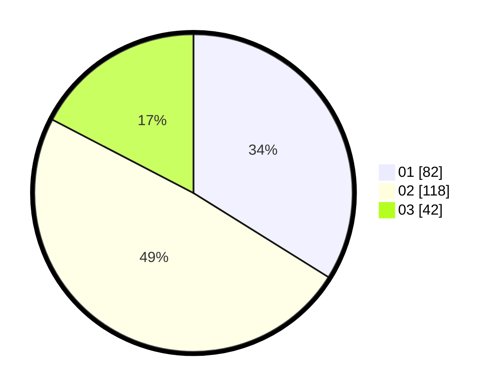

# Hasil

Hasil perolehan suara paslon dapat dilihat pada file paslon-01.txt, paslon-02.txt, dan paslon-03.txt.

Jika tidak ada, artinya data tersebut belum ada pada SIREKAP.

## Perolehan Suara

 * Paslon 01: **82**.
 * Paslon 02: **118**.
 * Paslon 03: **42**.

## Foto C Plano

https://sirekap-obj-formc.kpu.go.id/1f8c/pemilu/ppwp/31/74/10/10/02/3174101002059-20240216-014339--c5a9a15e-f1c0-4504-979b-1b960ee10804.jpg

https://sirekap-obj-formc.kpu.go.id/1f8c/pemilu/ppwp/31/74/10/10/02/3174101002059-20240216-014340--8cf8a38f-da02-4d72-aa60-2018999f2248.jpg

https://sirekap-obj-formc.kpu.go.id/1f8c/pemilu/ppwp/31/74/10/10/02/3174101002059-20240216-014339--46030ce2-f68a-431a-968a-e18c645b82a8.jpg

## DATA PEMILIH TETAP

Jumlah pemilih dalam DPT: **300**.
 * L: **139**.
 * P: **161**.

## DATA PENGGUNA HAK PILIH

Jumlah pengguna hak pilih dalam DPT: **246**.
 * L: **113**.
 * P: **133**.

Jumlah pengguna hak pilih dalam DPTb: **0**.
 * L: **0**.
 * P: **0**.

Jumlah pengguna hak pilih dalam DPK: **0**.
 * L: **0**.
 * P: **0**.

Jumlah pengguna hak pilih: **246**.
 * L: **113**.
 * P: **133**.

## JUMLAH SUARA SAH DAN TIDAK SAH

JUMLAH SELURUH SUARA SAH: **242**.

JUMLAH SUARA TIDAK SAH: **4**.

JUMLAH SELURUH SUARA SAH DAN SUARA TIDAK SAH: **246**.
