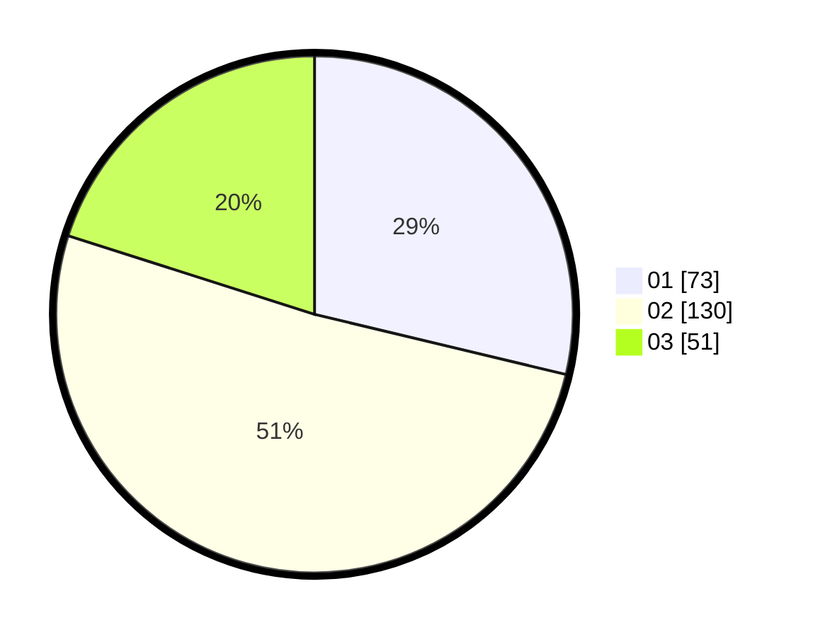

# Hasil

Hasil perolehan suara paslon dapat dilihat pada file paslon-01.txt, paslon-02.txt, dan paslon-03.txt.

Jika tidak ada, artinya data tersebut belum ada pada SIREKAP.

## Perolehan Suara

 * Paslon 01: **73**.
 * Paslon 02: **130**.
 * Paslon 03: **51**.

## Foto C Plano

https://sirekap-obj-formc.kpu.go.id/50bf/pemilu/ppwp/31/74/10/10/02/3174101002060-20240216-044827--9d2399e8-62fc-4007-9d18-e331cd38a98a.jpg

https://sirekap-obj-formc.kpu.go.id/50bf/pemilu/ppwp/31/74/10/10/02/3174101002060-20240216-045608--5136b8c5-3254-4720-b6b4-8dbbfe996905.jpg

https://sirekap-obj-formc.kpu.go.id/50bf/pemilu/ppwp/31/74/10/10/02/3174101002060-20240216-044837--e3ecd02b-22c0-445b-ad04-cb3c98c275a1.jpg

## DATA PEMILIH TETAP

Jumlah pemilih dalam DPT: **298**.
 * L: **157**.
 * P: **141**.

## DATA PENGGUNA HAK PILIH

Jumlah pengguna hak pilih dalam DPT: **255**.
 * L: **130**.
 * P: **125**.

Jumlah pengguna hak pilih dalam DPTb: **0**.
 * L: **0**.
 * P: **0**.

Jumlah pengguna hak pilih dalam DPK: **3**.
 * L: **2**.
 * P: **1**.

Jumlah pengguna hak pilih: **258**.
 * L: **132**.
 * P: **126**.

## JUMLAH SUARA SAH DAN TIDAK SAH

JUMLAH SELURUH SUARA SAH: **254**.

JUMLAH SUARA TIDAK SAH: **4**.

JUMLAH SELURUH SUARA SAH DAN SUARA TIDAK SAH: **258**.
