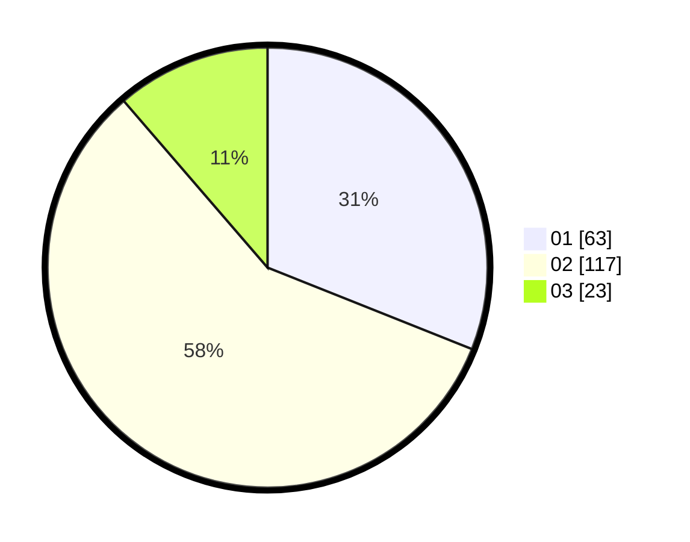

# Hasil

Hasil perolehan suara paslon dapat dilihat pada file paslon-01.txt, paslon-02.txt, dan paslon-03.txt.

Jika tidak ada, artinya data tersebut belum ada pada SIREKAP.

## Perolehan Suara

 * Paslon 01: **63**.
 * Paslon 02: **117**.
 * Paslon 03: **23**.

## Foto C Plano

https://sirekap-obj-formc.kpu.go.id/3cdc/pemilu/ppwp/31/74/10/10/02/3174101002070-20240214-155513--2751a4e9-0106-42ad-ac0b-44de8f8bea30.jpg

https://sirekap-obj-formc.kpu.go.id/3cdc/pemilu/ppwp/31/74/10/10/02/3174101002070-20240214-162225--7e9f1d31-57a2-4bd2-bb7e-d16fe5be4653.jpg

https://sirekap-obj-formc.kpu.go.id/3cdc/pemilu/ppwp/31/74/10/10/02/3174101002070-20240214-155657--a7fb8ba5-fb60-4a45-b36c-fd267c08576e.jpg

## DATA PEMILIH TETAP

Jumlah pemilih dalam DPT: **205**.
 * L: **99**.
 * P: **106**.

## DATA PENGGUNA HAK PILIH

Jumlah pengguna hak pilih dalam DPT: **205**.
 * L: **99**.
 * P: **106**.

Jumlah pengguna hak pilih dalam DPTb: **3**.
 * L: **1**.
 * P: **2**.

Jumlah pengguna hak pilih dalam DPK: **3**.
 * L: **0**.
 * P: **3**.

Jumlah pengguna hak pilih: **211**.
 * L: **100**.
 * P: **111**.

## JUMLAH SUARA SAH DAN TIDAK SAH

JUMLAH SELURUH SUARA SAH: **203**.

JUMLAH SUARA TIDAK SAH: **8**.

JUMLAH SELURUH SUARA SAH DAN SUARA TIDAK SAH: **211**.
