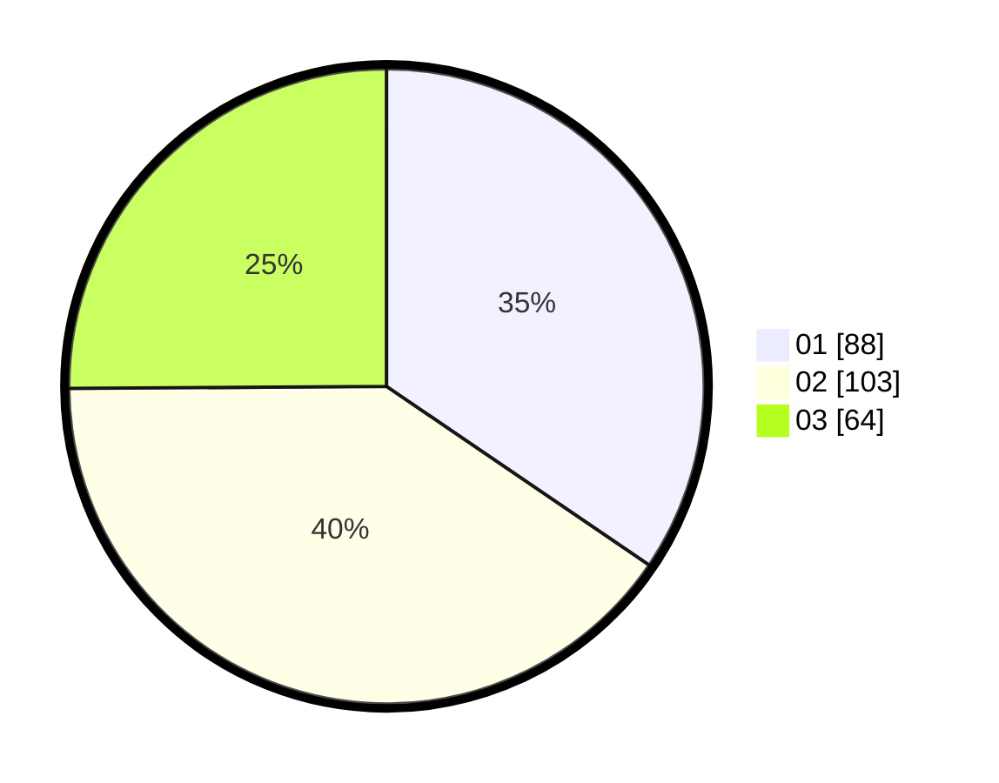

# Hasil

Hasil perolehan suara paslon dapat dilihat pada file paslon-01.txt, paslon-02.txt, dan paslon-03.txt.

Jika tidak ada, artinya data tersebut belum ada pada SIREKAP.

## Perolehan Suara

 * Paslon 01: **88**.
 * Paslon 02: **103**.
 * Paslon 03: **64**.

## Foto C Plano

https://sirekap-obj-formc.kpu.go.id/8e60/pemilu/ppwp/31/74/10/10/02/3174101002095-20240215-094817--a29feb92-2fb9-4065-a12a-f38d927588b3.jpg

https://sirekap-obj-formc.kpu.go.id/8e60/pemilu/ppwp/31/74/10/10/02/3174101002095-20240215-094838--7aeae8d4-12ab-47d3-8304-2e1f23da6b98.jpg

https://sirekap-obj-formc.kpu.go.id/8e60/pemilu/ppwp/31/74/10/10/02/3174101002095-20240215-094828--a411697a-69eb-404d-8388-b4b74b4be35b.jpg

## DATA PEMILIH TETAP

Jumlah pemilih dalam DPT: **290**.
 * L: **142**.
 * P: **148**.

## DATA PENGGUNA HAK PILIH

Jumlah pengguna hak pilih dalam DPT: **240**.
 * L: **115**.
 * P: **125**.

Jumlah pengguna hak pilih dalam DPTb: **18**.
 * L: **14**.
 * P: **4**.

Jumlah pengguna hak pilih dalam DPK: **0**.
 * L: **0**.
 * P: **0**.

Jumlah pengguna hak pilih: **258**.
 * L: **129**.
 * P: **129**.

## JUMLAH SUARA SAH DAN TIDAK SAH

JUMLAH SELURUH SUARA SAH: **255**.

JUMLAH SUARA TIDAK SAH: **3**.

JUMLAH SELURUH SUARA SAH DAN SUARA TIDAK SAH: **258**.
