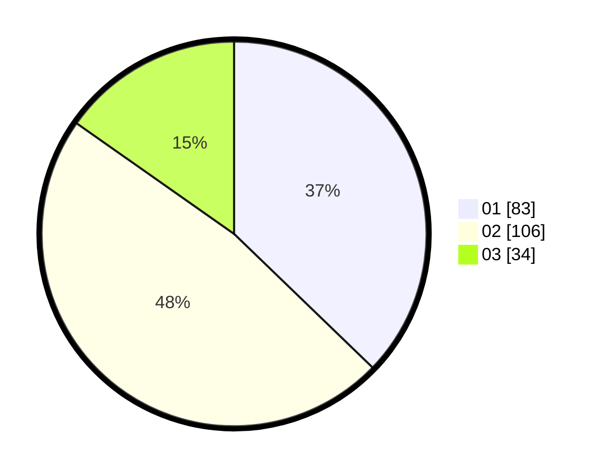

# Hasil

Hasil perolehan suara paslon dapat dilihat pada file paslon-01.txt, paslon-02.txt, dan paslon-03.txt.

Jika tidak ada, artinya data tersebut belum ada pada SIREKAP.

## Perolehan Suara

 * Paslon 01: **83**.
 * Paslon 02: **106**.
 * Paslon 03: **34**.

## Foto C Plano

https://sirekap-obj-formc.kpu.go.id/b613/pemilu/ppwp/31/74/10/10/02/3174101002116-20240215-231923--6d3d906d-88b9-4463-ad8e-90f83028c734.jpg

https://sirekap-obj-formc.kpu.go.id/b613/pemilu/ppwp/31/74/10/10/02/3174101002116-20240215-231928--bd9539e5-3e24-446f-8b6c-10dad809916d.jpg

https://sirekap-obj-formc.kpu.go.id/b613/pemilu/ppwp/31/74/10/10/02/3174101002116-20240215-231925--068e5ba5-1ce8-46e7-aa27-00da93307180.jpg

## DATA PEMILIH TETAP

Jumlah pemilih dalam DPT: **277**.
 * L: **134**.
 * P: **143**.

## DATA PENGGUNA HAK PILIH

Jumlah pengguna hak pilih dalam DPT: **218**.
 * L: **99**.
 * P: **119**.

Jumlah pengguna hak pilih dalam DPTb: **5**.
 * L: **3**.
 * P: **2**.

Jumlah pengguna hak pilih dalam DPK: **0**.
 * L: **0**.
 * P: **1**.

Jumlah pengguna hak pilih: **224**.
 * L: **102**.
 * P: **122**.

## JUMLAH SUARA SAH DAN TIDAK SAH

JUMLAH SELURUH SUARA SAH: **223**.

JUMLAH SUARA TIDAK SAH: **1**.

JUMLAH SELURUH SUARA SAH DAN SUARA TIDAK SAH: **224**.
