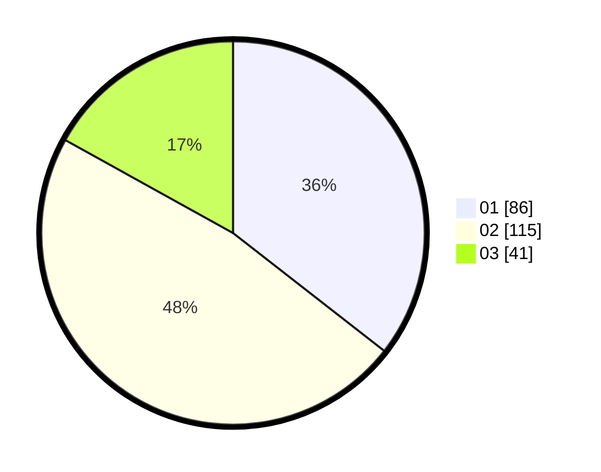

# Hasil

Hasil perolehan suara paslon dapat dilihat pada file paslon-01.txt, paslon-02.txt, dan paslon-03.txt.

Jika tidak ada, artinya data tersebut belum ada pada SIREKAP.

## Perolehan Suara

 * Paslon 01: **86**.
 * Paslon 02: **115**.
 * Paslon 03: **41**.

## Foto C Plano

https://sirekap-obj-formc.kpu.go.id/59ec/pemilu/ppwp/31/74/10/10/02/3174101002130-20240214-192922--b2fef1c2-12e9-4318-b950-1fd235e3cc6a.jpg

https://sirekap-obj-formc.kpu.go.id/59ec/pemilu/ppwp/31/74/10/10/02/3174101002130-20240214-193053--f1fce563-a55c-4e74-b5e2-5b3c017c9e5d.jpg

https://sirekap-obj-formc.kpu.go.id/59ec/pemilu/ppwp/31/74/10/10/02/3174101002130-20240214-193144--ea8992d5-79ff-4d76-85c3-90b81e813461.jpg

## DATA PEMILIH TETAP

Jumlah pemilih dalam DPT: **277**.
 * L: **132**.
 * P: **145**.

## DATA PENGGUNA HAK PILIH

Jumlah pengguna hak pilih dalam DPT: **235**.
 * L: **113**.
 * P: **122**.

Jumlah pengguna hak pilih dalam DPTb: **7**.
 * L: **4**.
 * P: **3**.

Jumlah pengguna hak pilih dalam DPK: **3**.
 * L: **1**.
 * P: **2**.

Jumlah pengguna hak pilih: **245**.
 * L: **118**.
 * P: **127**.

## JUMLAH SUARA SAH DAN TIDAK SAH

JUMLAH SELURUH SUARA SAH: **242**.

JUMLAH SUARA TIDAK SAH: **3**.

JUMLAH SELURUH SUARA SAH DAN SUARA TIDAK SAH: **245**.
