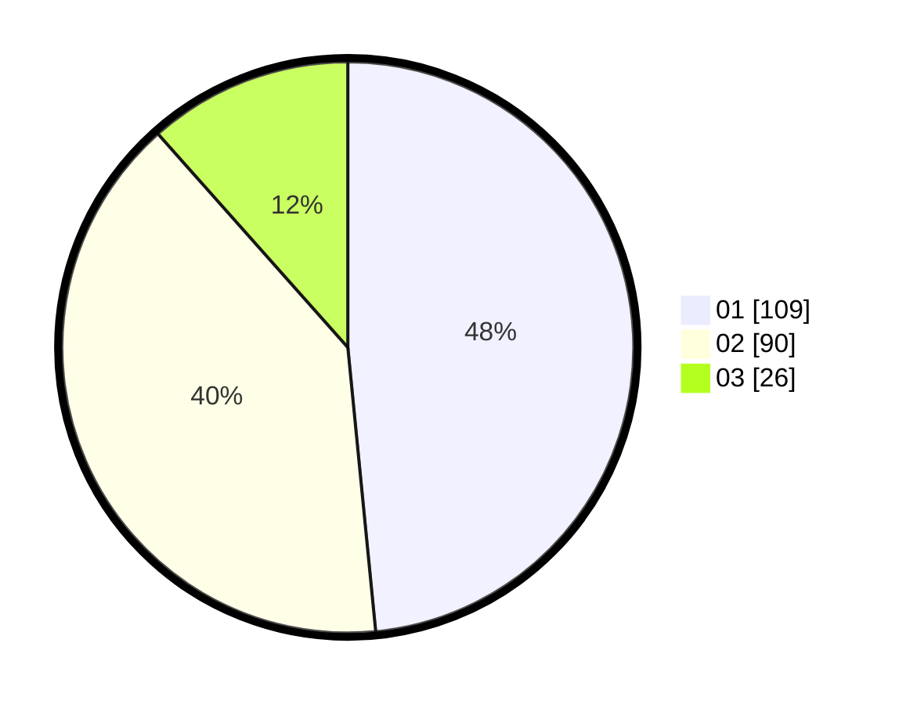

# Hasil

Hasil perolehan suara paslon dapat dilihat pada file paslon-01.txt, paslon-02.txt, dan paslon-03.txt.

Jika tidak ada, artinya data tersebut belum ada pada SIREKAP.

## Perolehan Suara

 * Paslon 01: **109**.
 * Paslon 02: **90**.
 * Paslon 03: **26**.

## Foto C Plano

https://sirekap-obj-formc.kpu.go.id/b030/pemilu/ppwp/31/74/10/10/02/3174101002135-20240216-193713--fcd5ca20-db91-4460-966f-3525f6d33b7d.jpg

https://sirekap-obj-formc.kpu.go.id/b030/pemilu/ppwp/31/74/10/10/02/3174101002135-20240216-193715--63d1115c-c82a-4893-a84a-835b1fd56b35.jpg

https://sirekap-obj-formc.kpu.go.id/b030/pemilu/ppwp/31/74/10/10/02/3174101002135-20240216-193714--6f15d05e-1ca3-4d87-8f7c-ba49472150ee.jpg

## DATA PEMILIH TETAP

Jumlah pemilih dalam DPT: **270**.
 * L: **135**.
 * P: **135**.

## DATA PENGGUNA HAK PILIH

Jumlah pengguna hak pilih dalam DPT: **225**.
 * L: **107**.
 * P: **118**.

Jumlah pengguna hak pilih dalam DPTb: **0**.
 * L: **0**.
 * P: **0**.

Jumlah pengguna hak pilih dalam DPK: **2**.
 * L: **1**.
 * P: **1**.

Jumlah pengguna hak pilih: **227**.
 * L: **108**.
 * P: **119**.

## JUMLAH SUARA SAH DAN TIDAK SAH

JUMLAH SELURUH SUARA SAH: **225**.

JUMLAH SUARA TIDAK SAH: **2**.

JUMLAH SELURUH SUARA SAH DAN SUARA TIDAK SAH: **227**.
