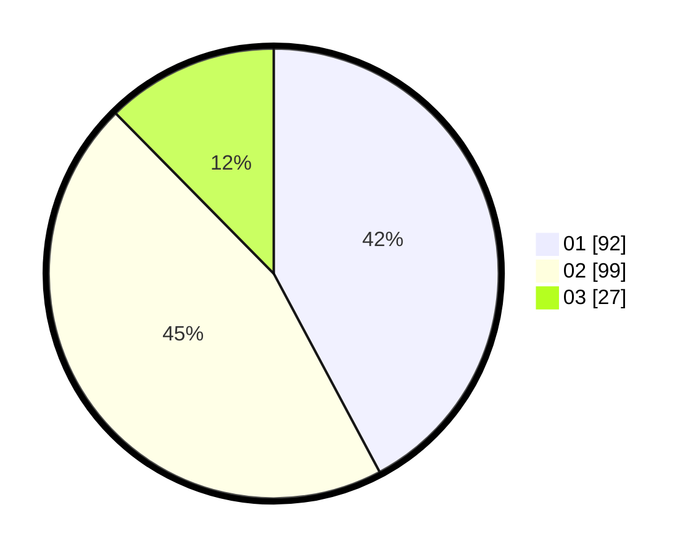

# Hasil

Hasil perolehan suara paslon dapat dilihat pada file paslon-01.txt, paslon-02.txt, dan paslon-03.txt.

Jika tidak ada, artinya data tersebut belum ada pada SIREKAP.

## Perolehan Suara

 * Paslon 01: **92**.
 * Paslon 02: **99**.
 * Paslon 03: **27**.

## Foto C Plano

https://sirekap-obj-formc.kpu.go.id/4453/pemilu/ppwp/31/74/10/10/02/3174101002163-20240214-185545--4130acd6-1758-441e-bf14-91b2f839ede1.jpg

https://sirekap-obj-formc.kpu.go.id/4453/pemilu/ppwp/31/74/10/10/02/3174101002163-20240214-190210--6eba087c-5078-4486-bb52-ca61f004914e.jpg

https://sirekap-obj-formc.kpu.go.id/4453/pemilu/ppwp/31/74/10/10/02/3174101002163-20240214-190358--79a4b7db-5af3-4c74-b9f2-0547c1965f04.jpg
