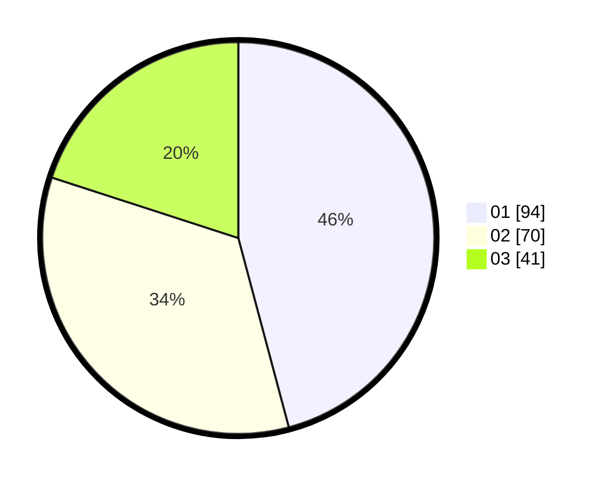

# Hasil

Hasil perolehan suara paslon dapat dilihat pada file paslon-01.txt, paslon-02.txt, dan paslon-03.txt.

Jika tidak ada, artinya data tersebut belum ada pada SIREKAP.

## Perolehan Suara

 * Paslon 01: **94**.
 * Paslon 02: **70**.
 * Paslon 03: **41**.

## Foto C Plano

https://sirekap-obj-formc.kpu.go.id/52f1/pemilu/ppwp/31/74/10/10/02/3174101002182-20240216-194607--4522b10d-3fe7-4e83-b792-66765b94fe2f.jpg

https://sirekap-obj-formc.kpu.go.id/52f1/pemilu/ppwp/31/74/10/10/02/3174101002182-20240216-194608--8677653f-d58a-4ca9-8c9c-d9667d4acf18.jpg

https://sirekap-obj-formc.kpu.go.id/52f1/pemilu/ppwp/31/74/10/10/02/3174101002182-20240216-194608--dd78c794-b6d4-4e51-9edd-2a89a176cf13.jpg

## DATA PEMILIH TETAP

Jumlah pemilih dalam DPT: **250**.
 * L: **114**.
 * P: **136**.

## DATA PENGGUNA HAK PILIH

Jumlah pengguna hak pilih dalam DPT: **200**.
 * L: **84**.
 * P: **116**.

Jumlah pengguna hak pilih dalam DPTb: **9**.
 * L: **9**.
 * P: **0**.

Jumlah pengguna hak pilih dalam DPK: **0**.
 * L: **0**.
 * P: **0**.

Jumlah pengguna hak pilih: **209**.
 * L: **93**.
 * P: **116**.

## JUMLAH SUARA SAH DAN TIDAK SAH

JUMLAH SELURUH SUARA SAH: **205**.

JUMLAH SUARA TIDAK SAH: **4**.

JUMLAH SELURUH SUARA SAH DAN SUARA TIDAK SAH: **209**.
