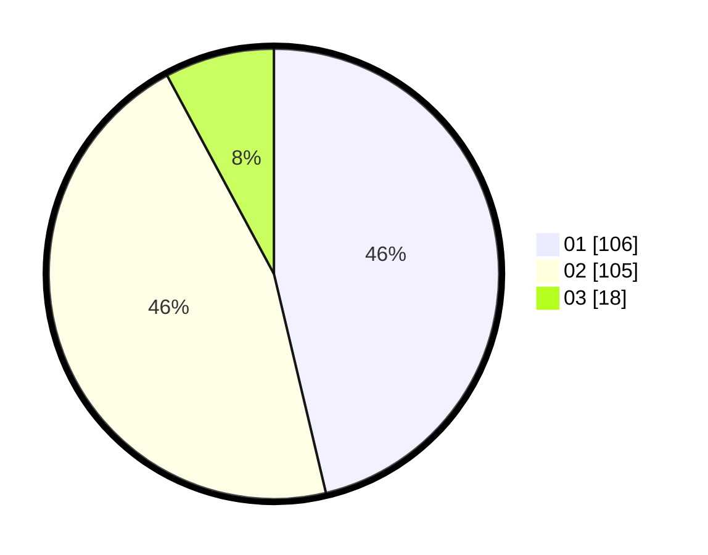

# Hasil

Hasil perolehan suara paslon dapat dilihat pada file paslon-01.txt, paslon-02.txt, dan paslon-03.txt.

Jika tidak ada, artinya data tersebut belum ada pada SIREKAP.

## Perolehan Suara

 * Paslon 01: **106**.
 * Paslon 02: **105**.
 * Paslon 03: **18**.

## Foto C Plano

https://sirekap-obj-formc.kpu.go.id/aac8/pemilu/ppwp/31/74/10/10/03/3174101003004-20240215-012155--9c5f2d3a-47ac-4fca-9a02-7338c03cf7fe.jpg

https://sirekap-obj-formc.kpu.go.id/aac8/pemilu/ppwp/31/74/10/10/03/3174101003004-20240218-181446--d596d05a-3c80-4f92-9b09-c30ff3d0d7b5.jpg

https://sirekap-obj-formc.kpu.go.id/aac8/pemilu/ppwp/31/74/10/10/03/3174101003004-20240218-181718--398d2cbd-fdd0-4438-9601-2baa10bba18e.jpg

## DATA PEMILIH TETAP

Jumlah pemilih dalam DPT: **285**.
 * L: **130**.
 * P: **155**.

## DATA PENGGUNA HAK PILIH

Jumlah pengguna hak pilih dalam DPT: **229**.
 * L: **101**.
 * P: **128**.

Jumlah pengguna hak pilih dalam DPTb: **0**.
 * L: **0**.
 * P: **0**.

Jumlah pengguna hak pilih dalam DPK: **3**.
 * L: **1**.
 * P: **2**.

Jumlah pengguna hak pilih: **232**.
 * L: **102**.
 * P: **130**.

## JUMLAH SUARA SAH DAN TIDAK SAH

JUMLAH SELURUH SUARA SAH: **229**.

JUMLAH SUARA TIDAK SAH: **3**.

JUMLAH SELURUH SUARA SAH DAN SUARA TIDAK SAH: **232**.
