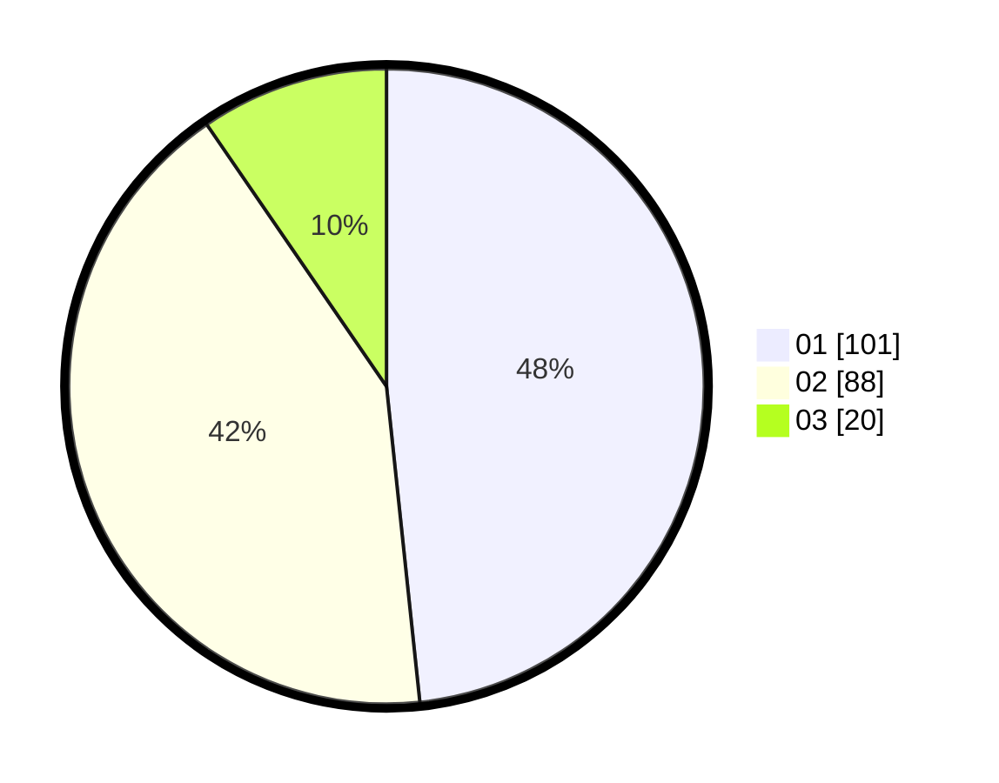

# Hasil

Hasil perolehan suara paslon dapat dilihat pada file paslon-01.txt, paslon-02.txt, dan paslon-03.txt.

Jika tidak ada, artinya data tersebut belum ada pada SIREKAP.

## Perolehan Suara

 * Paslon 01: **101**.
 * Paslon 02: **88**.
 * Paslon 03: **20**.

## Foto C Plano

https://sirekap-obj-formc.kpu.go.id/51e1/pemilu/ppwp/31/74/10/10/03/3174101003016-20240218-134612--464ac2bd-d512-479d-a80f-0ab37319b05f.jpg

https://sirekap-obj-formc.kpu.go.id/51e1/pemilu/ppwp/31/74/10/10/03/3174101003016-20240218-135112--fef691c0-1ed7-4465-ae3e-3d75df6a780d.jpg

https://sirekap-obj-formc.kpu.go.id/51e1/pemilu/ppwp/31/74/10/10/03/3174101003016-20240218-135335--f2a91e2e-a9f9-4e73-b1a7-7646a081f1a6.jpg

## DATA PEMILIH TETAP

Jumlah pemilih dalam DPT: **238**.
 * L: **112**.
 * P: **126**.

## DATA PENGGUNA HAK PILIH

Jumlah pengguna hak pilih dalam DPT: **209**.
 * L: **100**.
 * P: **109**.

Jumlah pengguna hak pilih dalam DPTb: **0**.
 * L: **0**.
 * P: **0**.

Jumlah pengguna hak pilih dalam DPK: **5**.
 * L: **2**.
 * P: **3**.

Jumlah pengguna hak pilih: **214**.
 * L: **102**.
 * P: **112**.

## JUMLAH SUARA SAH DAN TIDAK SAH

JUMLAH SELURUH SUARA SAH: **209**.

JUMLAH SUARA TIDAK SAH: **5**.

JUMLAH SELURUH SUARA SAH DAN SUARA TIDAK SAH: **214**.
