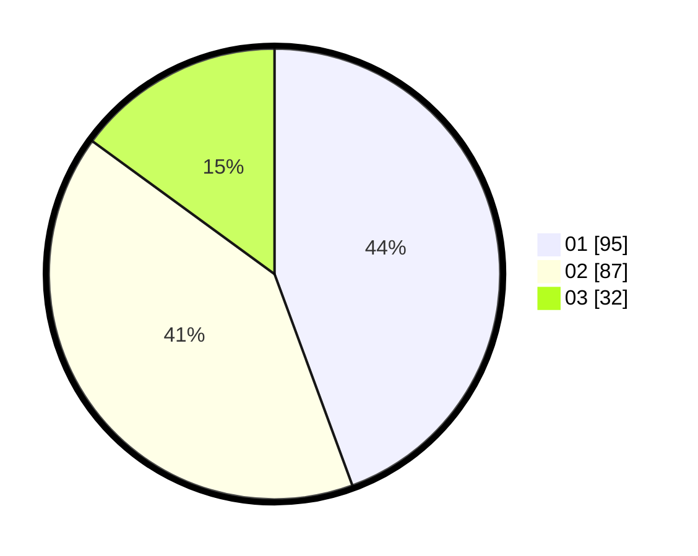

# Hasil

Hasil perolehan suara paslon dapat dilihat pada file paslon-01.txt, paslon-02.txt, dan paslon-03.txt.

Jika tidak ada, artinya data tersebut belum ada pada SIREKAP.

## Perolehan Suara

 * Paslon 01: **95**.
 * Paslon 02: **87**.
 * Paslon 03: **32**.

## Foto C Plano

https://sirekap-obj-formc.kpu.go.id/b1e3/pemilu/ppwp/31/74/10/10/03/3174101003025-20240218-113623--1ab1319a-fe18-4af3-8487-c33ae056e36c.jpg

https://sirekap-obj-formc.kpu.go.id/b1e3/pemilu/ppwp/31/74/10/10/03/3174101003025-20240218-113806--30e4c121-842e-477f-b857-469a3de7a730.jpg

https://sirekap-obj-formc.kpu.go.id/b1e3/pemilu/ppwp/31/74/10/10/03/3174101003025-20240218-113907--3c6abbab-677b-4362-b245-52830a81ff9d.jpg

## DATA PEMILIH TETAP

Jumlah pemilih dalam DPT: **270**.
 * L: **135**.
 * P: **135**.

## DATA PENGGUNA HAK PILIH

Jumlah pengguna hak pilih dalam DPT: **215**.
 * L: **103**.
 * P: **112**.

Jumlah pengguna hak pilih dalam DPTb: **0**.
 * L: **0**.
 * P: **0**.

Jumlah pengguna hak pilih dalam DPK: **3**.
 * L: **1**.
 * P: **2**.

Jumlah pengguna hak pilih: **218**.
 * L: **104**.
 * P: **114**.

## JUMLAH SUARA SAH DAN TIDAK SAH

JUMLAH SELURUH SUARA SAH: **214**.

JUMLAH SUARA TIDAK SAH: **4**.

JUMLAH SELURUH SUARA SAH DAN SUARA TIDAK SAH: **218**.
