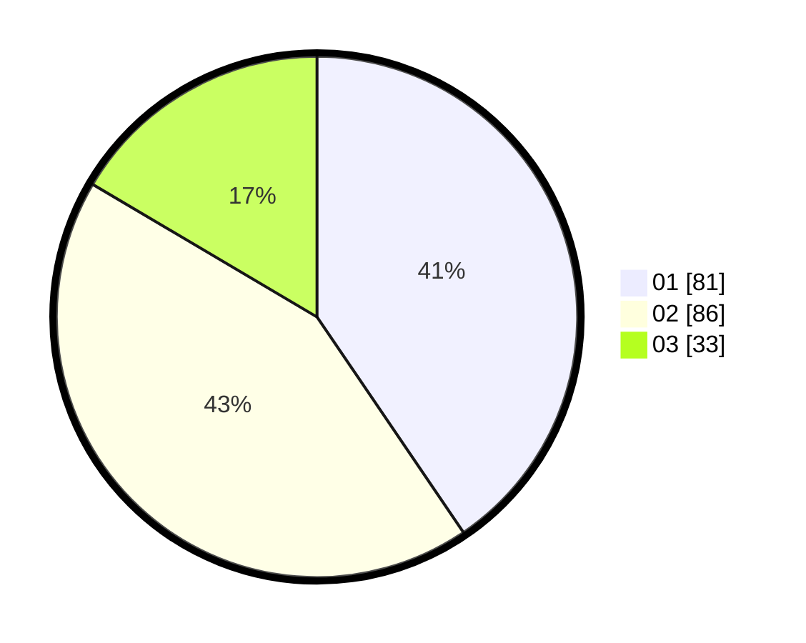

# Hasil

Hasil perolehan suara paslon dapat dilihat pada file paslon-01.txt, paslon-02.txt, dan paslon-03.txt.

Jika tidak ada, artinya data tersebut belum ada pada SIREKAP.

## Perolehan Suara

 * Paslon 01: **81**.
 * Paslon 02: **86**.
 * Paslon 03: **33**.

## Foto C Plano

https://sirekap-obj-formc.kpu.go.id/ad24/pemilu/ppwp/31/74/10/10/03/3174101003026-20240214-205128--016db0f3-c415-419e-b0ec-f7244ad077a0.jpg

https://sirekap-obj-formc.kpu.go.id/ad24/pemilu/ppwp/31/74/10/10/03/3174101003026-20240214-205135--0154a98c-987a-4725-91e3-c7eea21dbb4b.jpg

https://sirekap-obj-formc.kpu.go.id/ad24/pemilu/ppwp/31/74/10/10/03/3174101003026-20240214-205137--f05b7bfb-94f6-4e12-88b8-392500c60b63.jpg

## DATA PEMILIH TETAP

Jumlah pemilih dalam DPT: **265**.
 * L: **128**.
 * P: **137**.

## DATA PENGGUNA HAK PILIH

Jumlah pengguna hak pilih dalam DPT: **203**.
 * L: **100**.
 * P: **103**.

Jumlah pengguna hak pilih dalam DPTb: **2**.
 * L: **0**.
 * P: **0**.

Jumlah pengguna hak pilih dalam DPK: **0**.
 * L: **0**.
 * P: **0**.

Jumlah pengguna hak pilih: **203**.
 * L: **100**.
 * P: **103**.

## JUMLAH SUARA SAH DAN TIDAK SAH

JUMLAH SELURUH SUARA SAH: **200**.

JUMLAH SUARA TIDAK SAH: **3**.

JUMLAH SELURUH SUARA SAH DAN SUARA TIDAK SAH: **203**.
