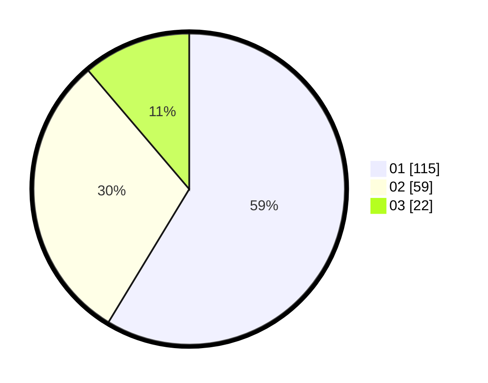

# Hasil

Hasil perolehan suara paslon dapat dilihat pada file paslon-01.txt, paslon-02.txt, dan paslon-03.txt.

Jika tidak ada, artinya data tersebut belum ada pada SIREKAP.

## Perolehan Suara

 * Paslon 01: **115**.
 * Paslon 02: **59**.
 * Paslon 03: **22**.

## Foto C Plano

https://sirekap-obj-formc.kpu.go.id/a010/pemilu/ppwp/31/74/10/10/03/3174101003031-20240216-210407--ae3ad981-9485-4081-a8ba-93f6511b46be.jpg

https://sirekap-obj-formc.kpu.go.id/a010/pemilu/ppwp/31/74/10/10/03/3174101003031-20240216-210408--79d06cd4-0539-4687-bd13-15730555cbfe.jpg

https://sirekap-obj-formc.kpu.go.id/a010/pemilu/ppwp/31/74/10/10/03/3174101003031-20240216-210407--c2606aa2-677a-423f-83e4-88dec45dca11.jpg

## DATA PEMILIH TETAP

Jumlah pemilih dalam DPT: **237**.
 * L: **116**.
 * P: **121**.

## DATA PENGGUNA HAK PILIH

Jumlah pengguna hak pilih dalam DPT: **194**.
 * L: **91**.
 * P: **103**.

Jumlah pengguna hak pilih dalam DPTb: **2**.
 * L: **1**.
 * P: **1**.

Jumlah pengguna hak pilih dalam DPK: **1**.
 * L: **0**.
 * P: **1**.

Jumlah pengguna hak pilih: **197**.
 * L: **92**.
 * P: **105**.

## JUMLAH SUARA SAH DAN TIDAK SAH

JUMLAH SELURUH SUARA SAH: **196**.

JUMLAH SUARA TIDAK SAH: **1**.

JUMLAH SELURUH SUARA SAH DAN SUARA TIDAK SAH: **197**.
