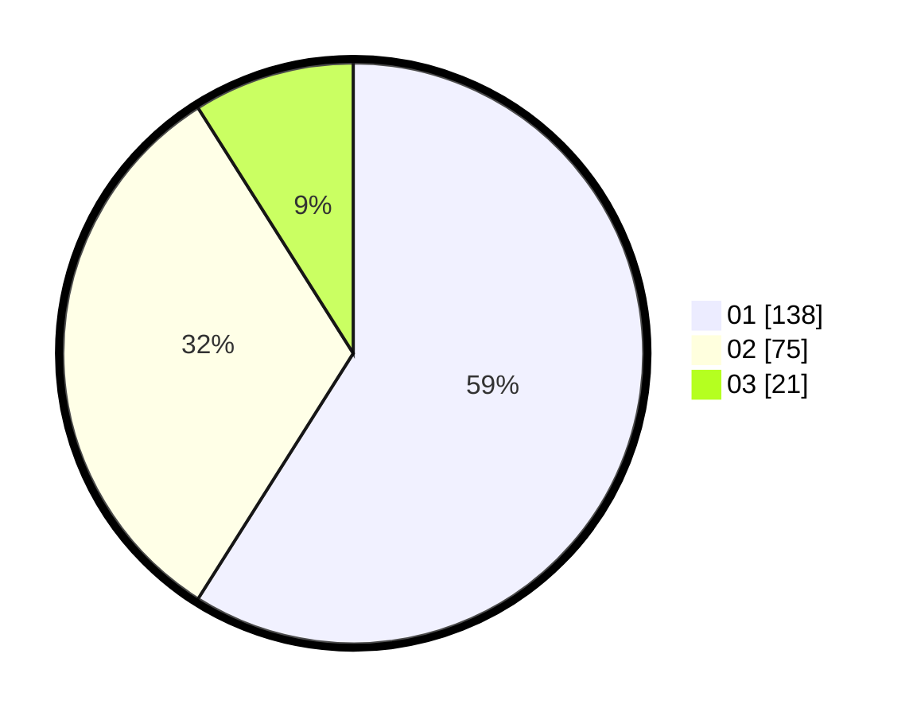

# Hasil

Hasil perolehan suara paslon dapat dilihat pada file paslon-01.txt, paslon-02.txt, dan paslon-03.txt.

Jika tidak ada, artinya data tersebut belum ada pada SIREKAP.

## Perolehan Suara

 * Paslon 01: **138**.
 * Paslon 02: **75**.
 * Paslon 03: **21**.

## Foto C Plano

https://sirekap-obj-formc.kpu.go.id/a290/pemilu/ppwp/31/74/10/10/03/3174101003041-20240215-063845--32e035b5-8bc2-4f18-b5ec-f37bf8183e0c.jpg

https://sirekap-obj-formc.kpu.go.id/a290/pemilu/ppwp/31/74/10/10/03/3174101003041-20240215-063910--04c12ea2-4fae-499e-8d12-e393f46e981b.jpg

https://sirekap-obj-formc.kpu.go.id/a290/pemilu/ppwp/31/74/10/10/03/3174101003041-20240215-063856--5ef2bf7f-7589-443a-b901-7273fb54a915.jpg

## DATA PEMILIH TETAP

Jumlah pemilih dalam DPT: **295**.
 * L: **155**.
 * P: **140**.

## DATA PENGGUNA HAK PILIH

Jumlah pengguna hak pilih dalam DPT: **238**.
 * L: **124**.
 * P: **114**.

Jumlah pengguna hak pilih dalam DPTb: **0**.
 * L: **0**.
 * P: **0**.

Jumlah pengguna hak pilih dalam DPK: **2**.
 * L: **1**.
 * P: **1**.

Jumlah pengguna hak pilih: **240**.
 * L: **125**.
 * P: **115**.

## JUMLAH SUARA SAH DAN TIDAK SAH

JUMLAH SELURUH SUARA SAH: **234**.

JUMLAH SUARA TIDAK SAH: **6**.

JUMLAH SELURUH SUARA SAH DAN SUARA TIDAK SAH: **240**.
