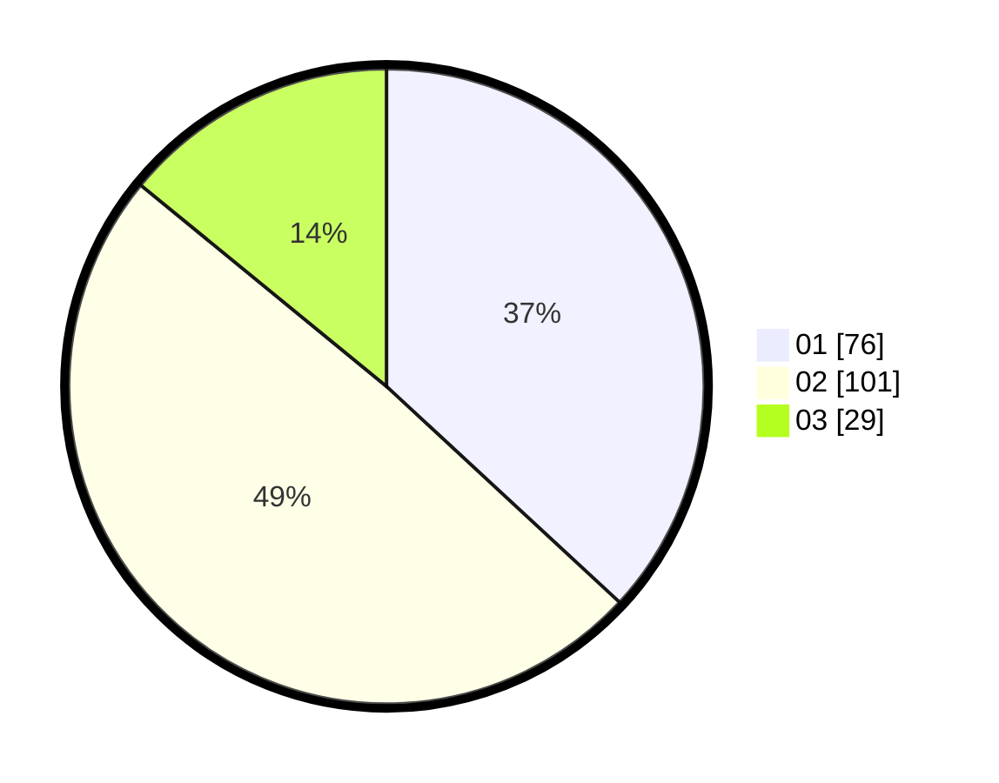

# Hasil

Hasil perolehan suara paslon dapat dilihat pada file paslon-01.txt, paslon-02.txt, dan paslon-03.txt.

Jika tidak ada, artinya data tersebut belum ada pada SIREKAP.

## Perolehan Suara

 * Paslon 01: **76**.
 * Paslon 02: **101**.
 * Paslon 03: **29**.

## Foto C Plano

https://sirekap-obj-formc.kpu.go.id/44e6/pemilu/ppwp/31/74/10/10/03/3174101003047-20240216-235931--5cd7d290-2663-47d5-a050-d445bc458c95.jpg

https://sirekap-obj-formc.kpu.go.id/44e6/pemilu/ppwp/31/74/10/10/03/3174101003047-20240216-235932--58d47ad6-f3f8-4303-9394-36a43428b42f.jpg

https://sirekap-obj-formc.kpu.go.id/44e6/pemilu/ppwp/31/74/10/10/03/3174101003047-20240216-235931--a9551d26-8a6a-4406-b5bb-19de7744da53.jpg

## DATA PEMILIH TETAP

Jumlah pemilih dalam DPT: **273**.
 * L: **138**.
 * P: **135**.

## DATA PENGGUNA HAK PILIH

Jumlah pengguna hak pilih dalam DPT: **208**.
 * L: **103**.
 * P: **105**.

Jumlah pengguna hak pilih dalam DPTb: **3**.
 * L: **2**.
 * P: **1**.

Jumlah pengguna hak pilih dalam DPK: **0**.
 * L: **0**.
 * P: **0**.

Jumlah pengguna hak pilih: **211**.
 * L: **105**.
 * P: **106**.

## JUMLAH SUARA SAH DAN TIDAK SAH

JUMLAH SELURUH SUARA SAH: **206**.

JUMLAH SUARA TIDAK SAH: **5**.

JUMLAH SELURUH SUARA SAH DAN SUARA TIDAK SAH: **211**.
