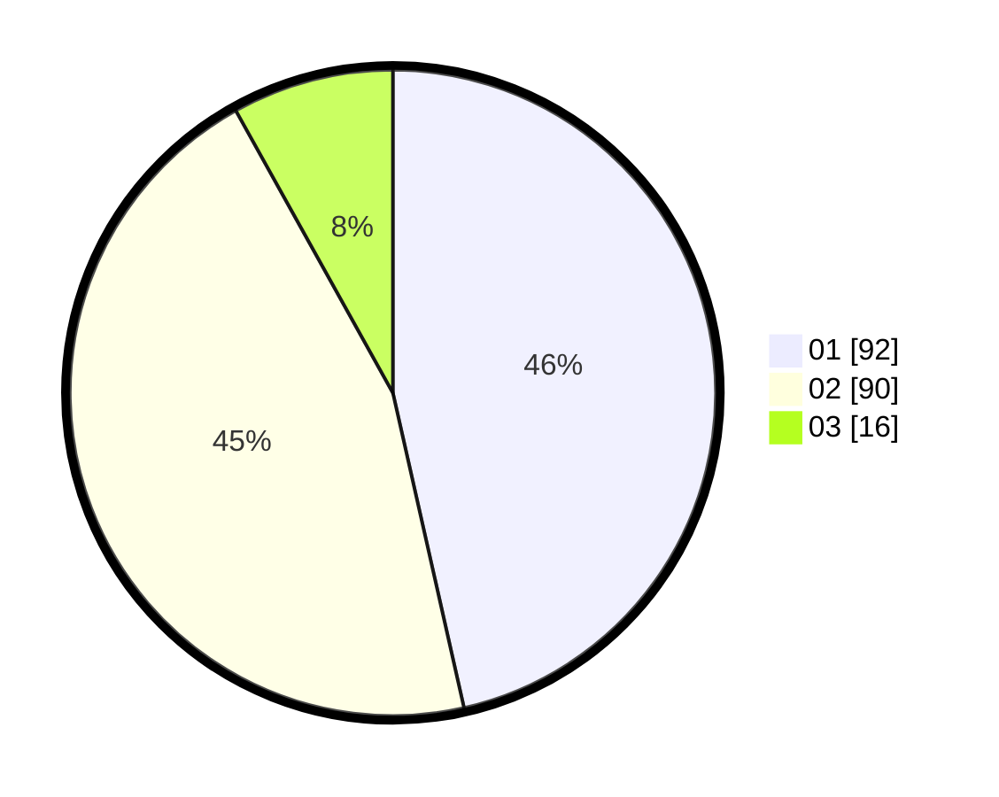

# Hasil

Hasil perolehan suara paslon dapat dilihat pada file paslon-01.txt, paslon-02.txt, dan paslon-03.txt.

Jika tidak ada, artinya data tersebut belum ada pada SIREKAP.

## Perolehan Suara

 * Paslon 01: **92**.
 * Paslon 02: **90**.
 * Paslon 03: **16**.

## Foto C Plano

https://sirekap-obj-formc.kpu.go.id/b320/pemilu/ppwp/31/74/10/10/03/3174101003049-20240216-125713--257b3eee-4318-4010-9674-e4ad551c20cd.jpg

https://sirekap-obj-formc.kpu.go.id/b320/pemilu/ppwp/31/74/10/10/03/3174101003049-20240216-125716--0cc25c95-2441-4358-8add-ce4a08e5c42c.jpg

https://sirekap-obj-formc.kpu.go.id/b320/pemilu/ppwp/31/74/10/10/03/3174101003049-20240216-125714--bf63a0fb-75af-4c83-90c8-77176fc0a4a8.jpg

## DATA PEMILIH TETAP

Jumlah pemilih dalam DPT: **244**.
 * L: **118**.
 * P: **126**.

## DATA PENGGUNA HAK PILIH

Jumlah pengguna hak pilih dalam DPT: **198**.
 * L: **96**.
 * P: **102**.

Jumlah pengguna hak pilih dalam DPTb: **2**.
 * L: **1**.
 * P: **1**.

Jumlah pengguna hak pilih dalam DPK: **1**.
 * L: **0**.
 * P: **1**.

Jumlah pengguna hak pilih: **201**.
 * L: **97**.
 * P: **104**.

## JUMLAH SUARA SAH DAN TIDAK SAH

JUMLAH SELURUH SUARA SAH: **198**.

JUMLAH SUARA TIDAK SAH: **3**.

JUMLAH SELURUH SUARA SAH DAN SUARA TIDAK SAH: **201**.
