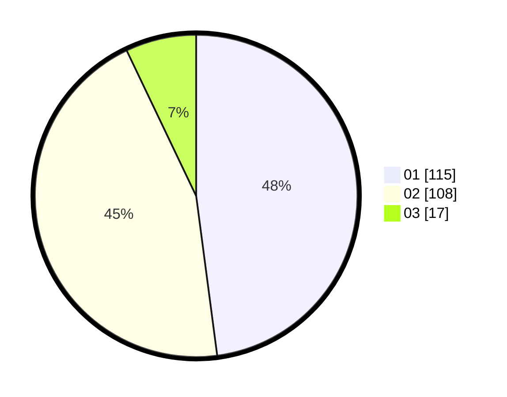

# Hasil

Hasil perolehan suara paslon dapat dilihat pada file paslon-01.txt, paslon-02.txt, dan paslon-03.txt.

Jika tidak ada, artinya data tersebut belum ada pada SIREKAP.

## Perolehan Suara

 * Paslon 01: **115**.
 * Paslon 02: **108**.
 * Paslon 03: **17**.

## Foto C Plano

https://sirekap-obj-formc.kpu.go.id/1946/pemilu/ppwp/31/74/10/10/03/3174101003061-20240216-121408--c79d38a1-7729-4b25-88cd-08d44c07a552.jpg

https://sirekap-obj-formc.kpu.go.id/1946/pemilu/ppwp/31/74/10/10/03/3174101003061-20240216-121409--3d0bb39a-5db3-441d-a885-0aa7d43276c5.jpg

https://sirekap-obj-formc.kpu.go.id/1946/pemilu/ppwp/31/74/10/10/03/3174101003061-20240216-121409--a890dffe-c0be-4e12-bb77-c4dbe3292544.jpg

## DATA PEMILIH TETAP

Jumlah pemilih dalam DPT: **0**.
 * L: **0**.
 * P: **0**.

## DATA PENGGUNA HAK PILIH

Jumlah pengguna hak pilih dalam DPT: **0**.
 * L: **0**.
 * P: **0**.

Jumlah pengguna hak pilih dalam DPTb: **0**.
 * L: **0**.
 * P: **0**.

Jumlah pengguna hak pilih dalam DPK: **0**.
 * L: **0**.
 * P: **0**.

Jumlah pengguna hak pilih: **0**.
 * L: **0**.
 * P: **0**.

## JUMLAH SUARA SAH DAN TIDAK SAH

JUMLAH SELURUH SUARA SAH: **240**.

JUMLAH SUARA TIDAK SAH: **4**.

JUMLAH SELURUH SUARA SAH DAN SUARA TIDAK SAH: **244**.
