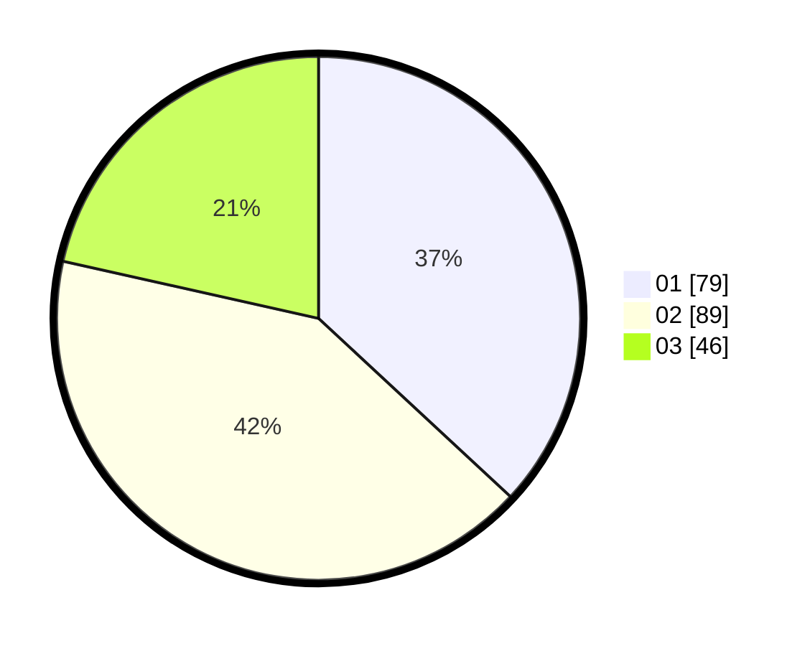

# Hasil

Hasil perolehan suara paslon dapat dilihat pada file paslon-01.txt, paslon-02.txt, dan paslon-03.txt.

Jika tidak ada, artinya data tersebut belum ada pada SIREKAP.

## Perolehan Suara

 * Paslon 01: **79**.
 * Paslon 02: **89**.
 * Paslon 03: **46**.

## Foto C Plano

https://sirekap-obj-formc.kpu.go.id/0ab5/pemilu/ppwp/31/74/10/10/03/3174101003076-20240216-073836--03708a4e-d6af-4ade-8bcd-06f4f793db92.jpg

https://sirekap-obj-formc.kpu.go.id/0ab5/pemilu/ppwp/31/74/10/10/03/3174101003076-20240216-073837--8121897d-0abb-410b-a9a1-a8843c0d5fd5.jpg

https://sirekap-obj-formc.kpu.go.id/0ab5/pemilu/ppwp/31/74/10/10/03/3174101003076-20240216-073836--9560b7be-790f-4904-822e-299904bc836b.jpg

## DATA PEMILIH TETAP

Jumlah pemilih dalam DPT: **276**.
 * L: **142**.
 * P: **134**.

## DATA PENGGUNA HAK PILIH

Jumlah pengguna hak pilih dalam DPT: **223**.
 * L: **111**.
 * P: **112**.

Jumlah pengguna hak pilih dalam DPTb: **0**.
 * L: **0**.
 * P: **0**.

Jumlah pengguna hak pilih dalam DPK: **0**.
 * L: **0**.
 * P: **0**.

Jumlah pengguna hak pilih: **223**.
 * L: **111**.
 * P: **112**.

## JUMLAH SUARA SAH DAN TIDAK SAH

JUMLAH SELURUH SUARA SAH: **214**.

JUMLAH SUARA TIDAK SAH: **9**.

JUMLAH SELURUH SUARA SAH DAN SUARA TIDAK SAH: **223**.
