# Hasil

Hasil perolehan suara paslon dapat dilihat pada file paslon-01.txt, paslon-02.txt, dan paslon-03.txt.

Jika tidak ada, artinya data tersebut belum ada pada SIREKAP.

## Perolehan Suara

 * Paslon 01: **129**.
 * Paslon 02: **74**.
 * Paslon 03: **17**.

```mermaid
%%{init: {"pie": {"textPosition": 0.5}, "themeVariables": {"pieOuterStrokeWidth": "5px"}} }%%
pie showData
    "01" : 129
    "02" : 74
    "03" : 17
```

## Foto C Plano

https://sirekap-obj-formc.kpu.go.id/20e0/pemilu/ppwp/31/74/10/10/03/3174101003079-20240214-155537--40f617f3-3125-405f-8a79-4e38c8f8a606.jpg

https://sirekap-obj-formc.kpu.go.id/20e0/pemilu/ppwp/31/74/10/10/03/3174101003079-20240214-155602--714977ca-0885-4c2f-9499-c4fcdc2ed0b1.jpg

https://sirekap-obj-formc.kpu.go.id/20e0/pemilu/ppwp/31/74/10/10/03/3174101003079-20240214-155638--9e01f112-88c3-45f8-825f-9c4506042816.jpg

## DATA PEMILIH TETAP

Jumlah pemilih dalam DPT: **222**.
 * L: **119**.
 * P: **103**.

## DATA PENGGUNA HAK PILIH

Jumlah pengguna hak pilih dalam DPT: **222**.
 * L: **119**.
 * P: **103**.

Jumlah pengguna hak pilih dalam DPTb: **0**.
 * L: **0**.
 * P: **0**.

Jumlah pengguna hak pilih dalam DPK: **1**.
 * L: **0**.
 * P: **1**.

Jumlah pengguna hak pilih: **223**.
 * L: **119**.
 * P: **104**.

## JUMLAH SUARA SAH DAN TIDAK SAH

JUMLAH SELURUH SUARA SAH: **220**.

JUMLAH SUARA TIDAK SAH: **3**.

JUMLAH SELURUH SUARA SAH DAN SUARA TIDAK SAH: **223**.
