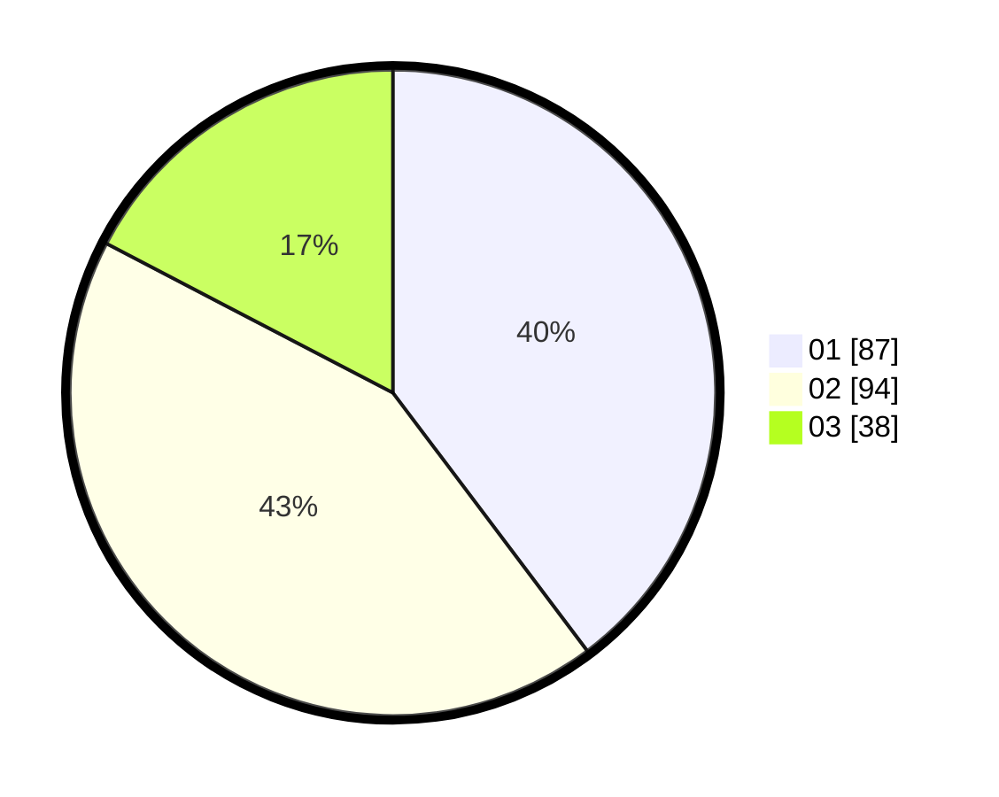

# Hasil

Hasil perolehan suara paslon dapat dilihat pada file paslon-01.txt, paslon-02.txt, dan paslon-03.txt.

Jika tidak ada, artinya data tersebut belum ada pada SIREKAP.

## Perolehan Suara

 * Paslon 01: **87**.
 * Paslon 02: **94**.
 * Paslon 03: **38**.

## Foto C Plano

https://sirekap-obj-formc.kpu.go.id/b102/pemilu/ppwp/31/74/10/10/03/3174101003084-20240214-155549--3f210bbd-e74a-4fed-815f-9ccadc585644.jpg

https://sirekap-obj-formc.kpu.go.id/b102/pemilu/ppwp/31/74/10/10/03/3174101003084-20240214-155735--2fedf5d8-23bd-461d-84e5-7ffec7655c4d.jpg
