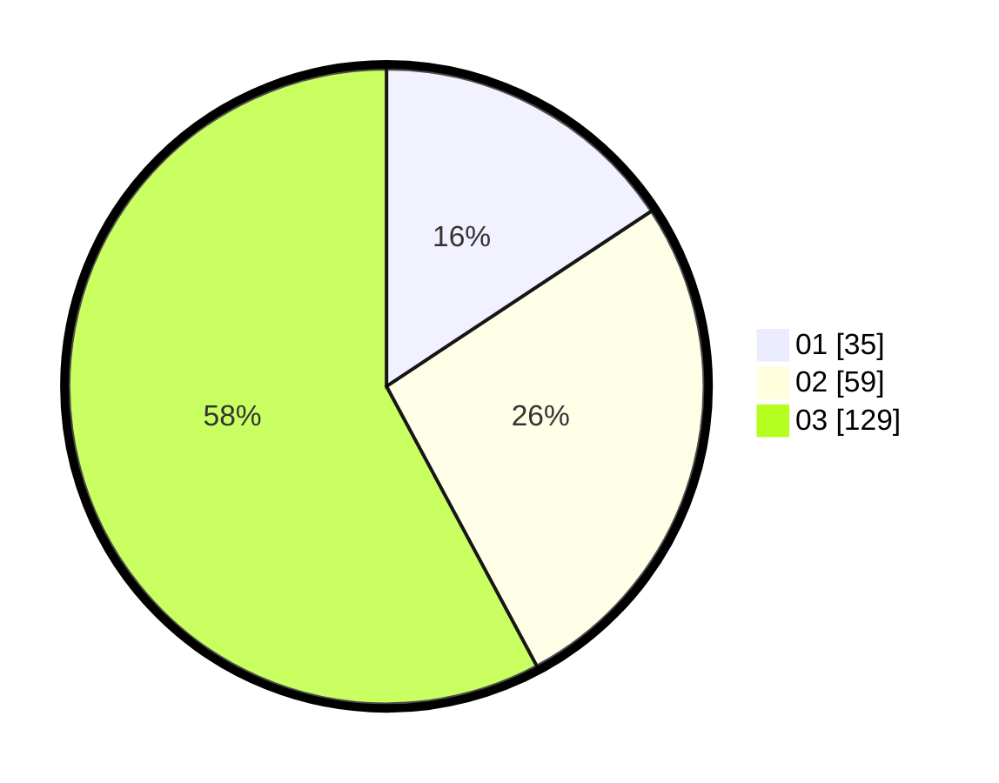

# Hasil

Hasil perolehan suara paslon dapat dilihat pada file paslon-01.txt, paslon-02.txt, dan paslon-03.txt.

Jika tidak ada, artinya data tersebut belum ada pada SIREKAP.

## Perolehan Suara

 * Paslon 01: **35**.
 * Paslon 02: **59**.
 * Paslon 03: **129**.

## Foto C Plano

https://sirekap-obj-formc.kpu.go.id/89ad/pemilu/ppwp/31/74/10/10/03/3174101003116-20240214-155354--6b7fe8d9-e2a3-4beb-adee-d5a0deafdf9a.jpg

https://sirekap-obj-formc.kpu.go.id/89ad/pemilu/ppwp/31/74/10/10/03/3174101003116-20240214-160057--d4968b46-5900-40bb-b547-fd80bb40b4cd.jpg

https://sirekap-obj-formc.kpu.go.id/89ad/pemilu/ppwp/31/74/10/10/03/3174101003116-20240214-155545--3c6e643c-6e96-4419-9e5a-2010e0bc6fba.jpg

## DATA PEMILIH TETAP

Jumlah pemilih dalam DPT: **282**.
 * L: **134**.
 * P: **148**.

## DATA PENGGUNA HAK PILIH

Jumlah pengguna hak pilih dalam DPT: **223**.
 * L: **107**.
 * P: **116**.

Jumlah pengguna hak pilih dalam DPTb: **0**.
 * L: **0**.
 * P: **0**.

Jumlah pengguna hak pilih dalam DPK: **3**.
 * L: **1**.
 * P: **2**.

Jumlah pengguna hak pilih: **226**.
 * L: **108**.
 * P: **118**.

## JUMLAH SUARA SAH DAN TIDAK SAH

JUMLAH SELURUH SUARA SAH: **223**.

JUMLAH SUARA TIDAK SAH: **3**.

JUMLAH SELURUH SUARA SAH DAN SUARA TIDAK SAH: **226**.
