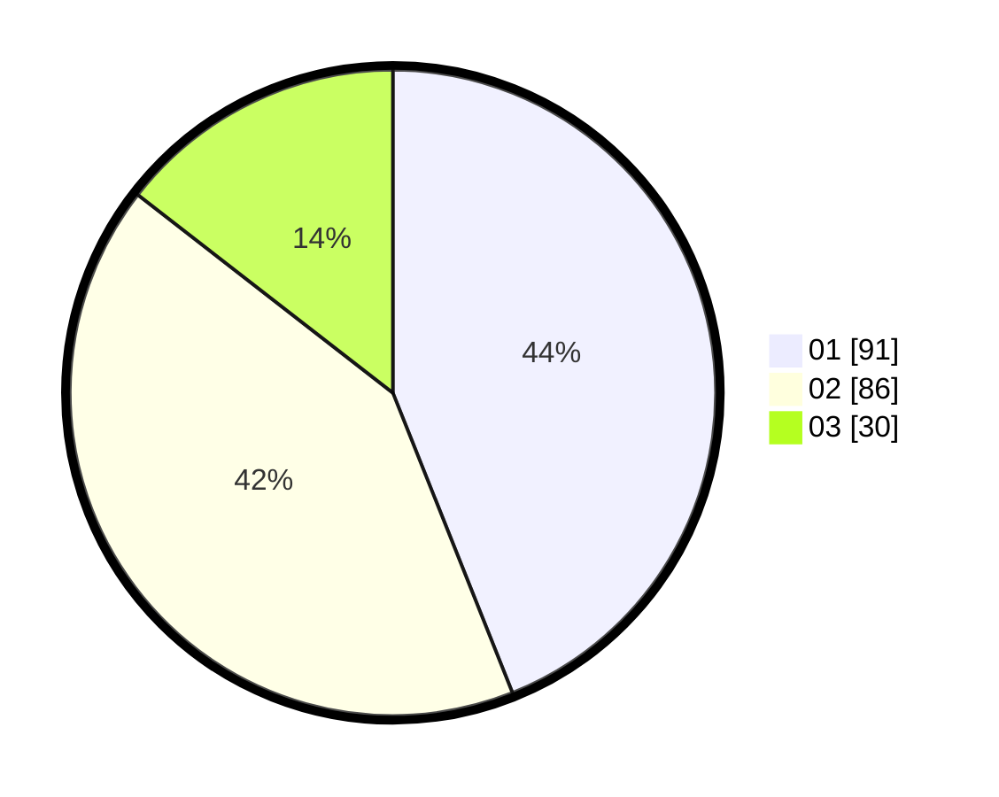

# Hasil

Hasil perolehan suara paslon dapat dilihat pada file paslon-01.txt, paslon-02.txt, dan paslon-03.txt.

Jika tidak ada, artinya data tersebut belum ada pada SIREKAP.

## Perolehan Suara

 * Paslon 01: **91**.
 * Paslon 02: **86**.
 * Paslon 03: **30**.

## Foto C Plano

https://sirekap-obj-formc.kpu.go.id/3c20/pemilu/ppwp/31/74/10/10/03/3174101003122-20240214-202822--4c18c1d8-a32d-413f-9e13-f8b27bb4c12f.jpg

https://sirekap-obj-formc.kpu.go.id/3c20/pemilu/ppwp/31/74/10/10/03/3174101003122-20240214-202920--29e6bd83-b771-4dc0-acbd-aaae4f412b6e.jpg

https://sirekap-obj-formc.kpu.go.id/3c20/pemilu/ppwp/31/74/10/10/03/3174101003122-20240214-203134--2d2b4fe4-54b1-421a-b9ca-2e95a6c7242a.jpg

## DATA PEMILIH TETAP

Jumlah pemilih dalam DPT: **258**.
 * L: **130**.
 * P: **128**.

## DATA PENGGUNA HAK PILIH

Jumlah pengguna hak pilih dalam DPT: **214**.
 * L: **103**.
 * P: **111**.

Jumlah pengguna hak pilih dalam DPTb: **1**.
 * L: **1**.
 * P: **0**.

Jumlah pengguna hak pilih dalam DPK: **2**.
 * L: **0**.
 * P: **2**.

Jumlah pengguna hak pilih: **217**.
 * L: **104**.
 * P: **113**.

## JUMLAH SUARA SAH DAN TIDAK SAH

JUMLAH SELURUH SUARA SAH: **207**.

JUMLAH SUARA TIDAK SAH: **10**.

JUMLAH SELURUH SUARA SAH DAN SUARA TIDAK SAH: **217**.
