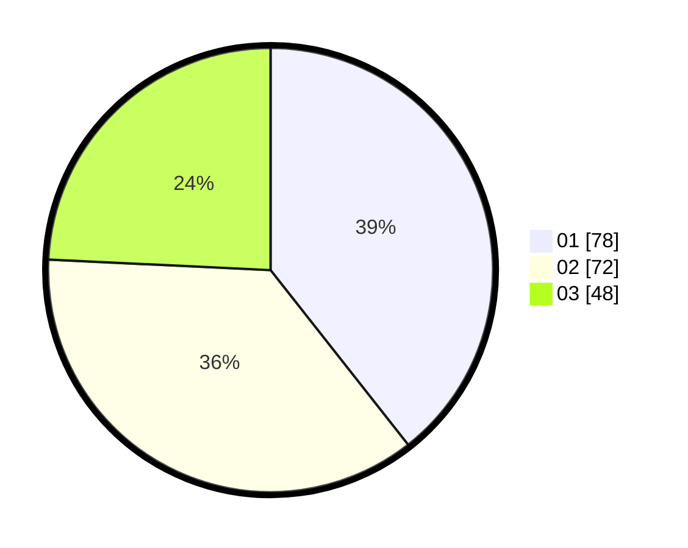

# Hasil

Hasil perolehan suara paslon dapat dilihat pada file paslon-01.txt, paslon-02.txt, dan paslon-03.txt.

Jika tidak ada, artinya data tersebut belum ada pada SIREKAP.

## Perolehan Suara

 * Paslon 01: **78**.
 * Paslon 02: **72**.
 * Paslon 03: **48**.

## Foto C Plano

https://sirekap-obj-formc.kpu.go.id/2a2b/pemilu/ppwp/31/74/10/10/03/3174101003127-20240216-074043--0016f487-f2dc-47f3-824c-240d3b61f482.jpg

https://sirekap-obj-formc.kpu.go.id/2a2b/pemilu/ppwp/31/74/10/10/03/3174101003127-20240216-042139--f33f9d15-4434-446c-a6cf-f6f202813e40.jpg

https://sirekap-obj-formc.kpu.go.id/2a2b/pemilu/ppwp/31/74/10/10/03/3174101003127-20240216-074044--ba8d0477-3759-4ba6-ab53-335e1a20932c.jpg

## DATA PEMILIH TETAP

Jumlah pemilih dalam DPT: **249**.
 * L: **123**.
 * P: **126**.

## DATA PENGGUNA HAK PILIH

Jumlah pengguna hak pilih dalam DPT: **199**.
 * L: **95**.
 * P: **104**.

Jumlah pengguna hak pilih dalam DPTb: **1**.
 * L: **1**.
 * P: **0**.

Jumlah pengguna hak pilih dalam DPK: **3**.
 * L: **2**.
 * P: **1**.

Jumlah pengguna hak pilih: **203**.
 * L: **98**.
 * P: **105**.

## JUMLAH SUARA SAH DAN TIDAK SAH

JUMLAH SELURUH SUARA SAH: **198**.

JUMLAH SUARA TIDAK SAH: **5**.

JUMLAH SELURUH SUARA SAH DAN SUARA TIDAK SAH: **203**.
