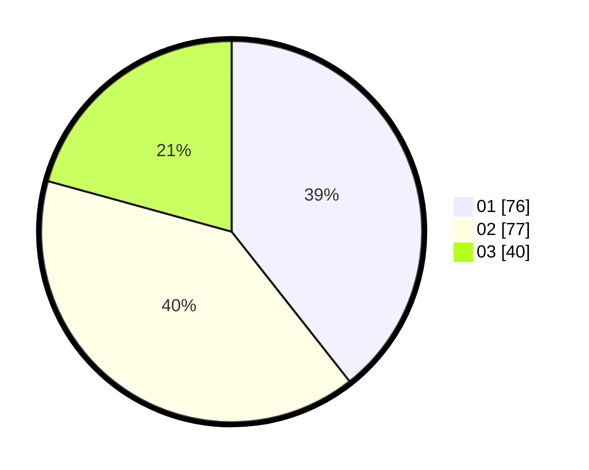

# Hasil

Hasil perolehan suara paslon dapat dilihat pada file paslon-01.txt, paslon-02.txt, dan paslon-03.txt.

Jika tidak ada, artinya data tersebut belum ada pada SIREKAP.

## Perolehan Suara

 * Paslon 01: **76**.
 * Paslon 02: **77**.
 * Paslon 03: **40**.

## Foto C Plano

https://sirekap-obj-formc.kpu.go.id/ed34/pemilu/ppwp/31/74/10/10/03/3174101003128-20240214-223304--d71eac1e-4788-4874-8efa-1536cf0b2ad6.jpg

https://sirekap-obj-formc.kpu.go.id/ed34/pemilu/ppwp/31/74/10/10/03/3174101003128-20240214-223339--877297c6-b618-4215-bfaa-824ff2ba224e.jpg

https://sirekap-obj-formc.kpu.go.id/ed34/pemilu/ppwp/31/74/10/10/03/3174101003128-20240214-223437--86b19692-ede2-4234-a584-adf574749d07.jpg

## DATA PEMILIH TETAP

Jumlah pemilih dalam DPT: **240**.
 * L: **113**.
 * P: **127**.

## DATA PENGGUNA HAK PILIH

Jumlah pengguna hak pilih dalam DPT: **190**.
 * L: **89**.
 * P: **101**.

Jumlah pengguna hak pilih dalam DPTb: **5**.
 * L: **2**.
 * P: **3**.

Jumlah pengguna hak pilih dalam DPK: **0**.
 * L: **0**.
 * P: **0**.

Jumlah pengguna hak pilih: **195**.
 * L: **91**.
 * P: **104**.

## JUMLAH SUARA SAH DAN TIDAK SAH

JUMLAH SELURUH SUARA SAH: **193**.

JUMLAH SUARA TIDAK SAH: **2**.

JUMLAH SELURUH SUARA SAH DAN SUARA TIDAK SAH: **195**.
