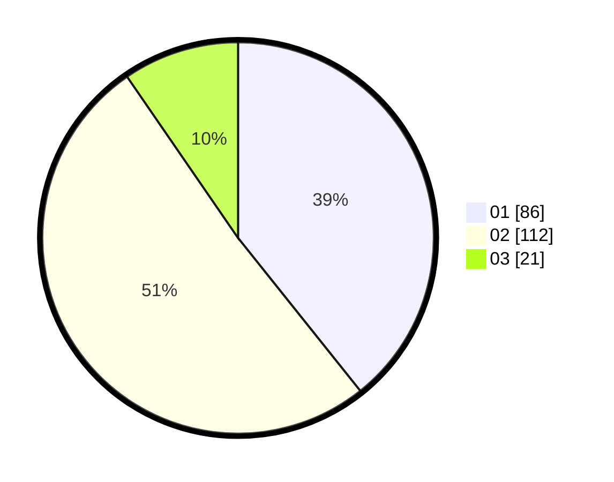

# Hasil

Hasil perolehan suara paslon dapat dilihat pada file paslon-01.txt, paslon-02.txt, dan paslon-03.txt.

Jika tidak ada, artinya data tersebut belum ada pada SIREKAP.

## Perolehan Suara

 * Paslon 01: **86**.
 * Paslon 02: **112**.
 * Paslon 03: **21**.

## Foto C Plano

https://sirekap-obj-formc.kpu.go.id/e76b/pemilu/ppwp/31/74/10/10/03/3174101003130-20240214-204502--b4450fda-7bb3-4e05-94f8-5a24b22c4c31.jpg

https://sirekap-obj-formc.kpu.go.id/e76b/pemilu/ppwp/31/74/10/10/03/3174101003130-20240214-204545--d27029be-464a-4f33-bdae-ec2827af1c7d.jpg

https://sirekap-obj-formc.kpu.go.id/e76b/pemilu/ppwp/31/74/10/10/03/3174101003130-20240214-204730--bf9d1d88-0047-4672-84ff-abb70f984803.jpg

## DATA PEMILIH TETAP

Jumlah pemilih dalam DPT: **292**.
 * L: **143**.
 * P: **149**.

## DATA PENGGUNA HAK PILIH

Jumlah pengguna hak pilih dalam DPT: **216**.
 * L: **101**.
 * P: **115**.

Jumlah pengguna hak pilih dalam DPTb: **3**.
 * L: **2**.
 * P: **1**.

Jumlah pengguna hak pilih dalam DPK: **4**.
 * L: **0**.
 * P: **4**.

Jumlah pengguna hak pilih: **223**.
 * L: **103**.
 * P: **120**.

## JUMLAH SUARA SAH DAN TIDAK SAH

JUMLAH SELURUH SUARA SAH: **219**.

JUMLAH SUARA TIDAK SAH: **4**.

JUMLAH SELURUH SUARA SAH DAN SUARA TIDAK SAH: **223**.
