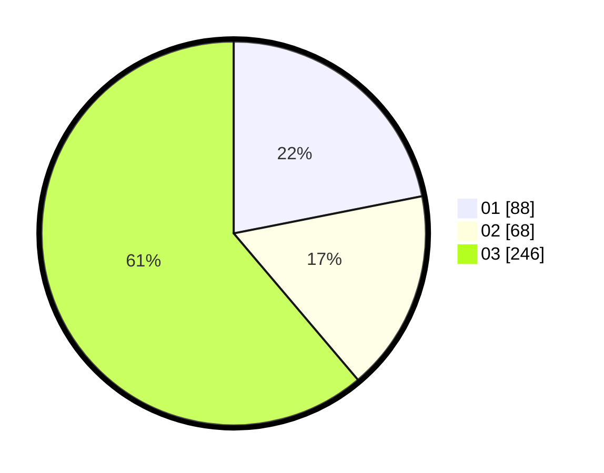

# Hasil

Hasil perolehan suara paslon dapat dilihat pada file paslon-01.txt, paslon-02.txt, dan paslon-03.txt.

Jika tidak ada, artinya data tersebut belum ada pada SIREKAP.

## Perolehan Suara

 * Paslon 01: **88**.
 * Paslon 02: **68**.
 * Paslon 03: **246**.

## Foto C Plano

https://sirekap-obj-formc.kpu.go.id/40e0/pemilu/ppwp/31/74/10/10/03/3174101003134-20240215-015431--ca59af22-510d-44fc-9c88-c5a539d1e51e.jpg

https://sirekap-obj-formc.kpu.go.id/40e0/pemilu/ppwp/31/74/10/10/03/3174101003134-20240215-014809--475df44c-d60c-4b6f-8bc4-15677886ad7e.jpg

https://sirekap-obj-formc.kpu.go.id/40e0/pemilu/ppwp/31/74/10/10/03/3174101003134-20240215-014956--2e29bf34-70b4-473e-aae1-9bc842f42ace.jpg

## DATA PEMILIH TETAP

Jumlah pemilih dalam DPT: **240**.
 * L: **123**.
 * P: **117**.

## DATA PENGGUNA HAK PILIH

Jumlah pengguna hak pilih dalam DPT: **202**.
 * L: **101**.
 * P: **101**.

Jumlah pengguna hak pilih dalam DPTb: **2**.
 * L: **1**.
 * P: **1**.

Jumlah pengguna hak pilih dalam DPK: **1**.
 * L: **0**.
 * P: **1**.

Jumlah pengguna hak pilih: **205**.
 * L: **0**.
 * P: **0**.

## JUMLAH SUARA SAH DAN TIDAK SAH

JUMLAH SELURUH SUARA SAH: **202**.

JUMLAH SUARA TIDAK SAH: **3**.

JUMLAH SELURUH SUARA SAH DAN SUARA TIDAK SAH: **205**.
