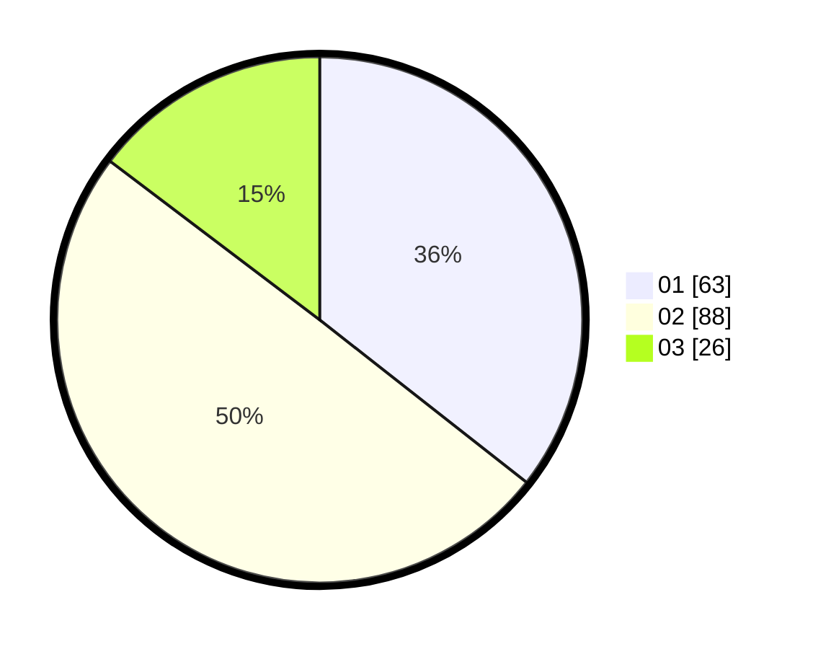

# Hasil

Hasil perolehan suara paslon dapat dilihat pada file paslon-01.txt, paslon-02.txt, dan paslon-03.txt.

Jika tidak ada, artinya data tersebut belum ada pada SIREKAP.

## Perolehan Suara

 * Paslon 01: **63**.
 * Paslon 02: **88**.
 * Paslon 03: **26**.

## Foto C Plano

https://sirekap-obj-formc.kpu.go.id/3239/pemilu/ppwp/31/74/10/10/03/3174101003137-20240214-191427--692595bb-1e79-4977-a7a2-89eb14d58b80.jpg

https://sirekap-obj-formc.kpu.go.id/3239/pemilu/ppwp/31/74/10/10/03/3174101003137-20240214-191441--b99ac922-ec27-45bd-acf9-08b62def51ce.jpg

https://sirekap-obj-formc.kpu.go.id/3239/pemilu/ppwp/31/74/10/10/03/3174101003137-20240214-191449--df4dc98c-f084-4d9d-95dc-4b704c9ca198.jpg

## DATA PEMILIH TETAP

Jumlah pemilih dalam DPT: **250**.
 * L: **130**.
 * P: **120**.

## DATA PENGGUNA HAK PILIH

Jumlah pengguna hak pilih dalam DPT: **191**.
 * L: **97**.
 * P: **94**.

Jumlah pengguna hak pilih dalam DPTb: **1**.
 * L: **1**.
 * P: **0**.

Jumlah pengguna hak pilih dalam DPK: **0**.
 * L: **0**.
 * P: **0**.

Jumlah pengguna hak pilih: **192**.
 * L: **98**.
 * P: **94**.

## JUMLAH SUARA SAH DAN TIDAK SAH

JUMLAH SELURUH SUARA SAH: **177**.

JUMLAH SUARA TIDAK SAH: **15**.

JUMLAH SELURUH SUARA SAH DAN SUARA TIDAK SAH: **192**.
