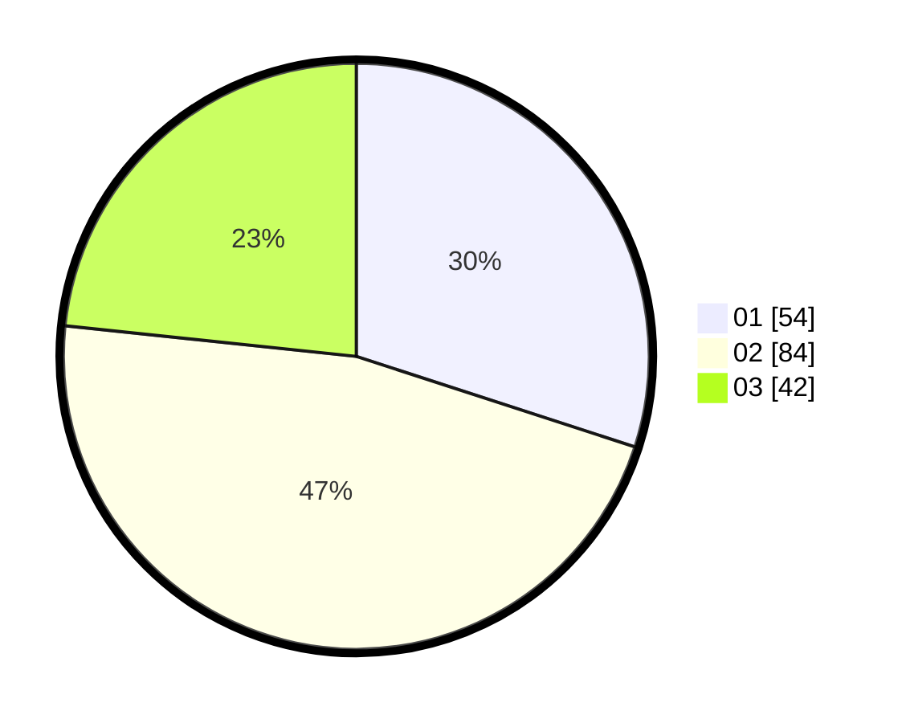

# Hasil

Hasil perolehan suara paslon dapat dilihat pada file paslon-01.txt, paslon-02.txt, dan paslon-03.txt.

Jika tidak ada, artinya data tersebut belum ada pada SIREKAP.

## Perolehan Suara

 * Paslon 01: **54**.
 * Paslon 02: **84**.
 * Paslon 03: **42**.

## Foto C Plano

https://sirekap-obj-formc.kpu.go.id/3390/pemilu/ppwp/31/74/10/10/03/3174101003139-20240215-001425--cb7035b6-596a-47f3-a431-411a78ac345e.jpg

https://sirekap-obj-formc.kpu.go.id/3390/pemilu/ppwp/31/74/10/10/03/3174101003139-20240214-211454--ac0184fb-57c5-4608-b000-2dd81cb4eadc.jpg

https://sirekap-obj-formc.kpu.go.id/3390/pemilu/ppwp/31/74/10/10/03/3174101003139-20240214-211925--0a4e4729-3866-4887-a5d5-e7f61531077a.jpg
