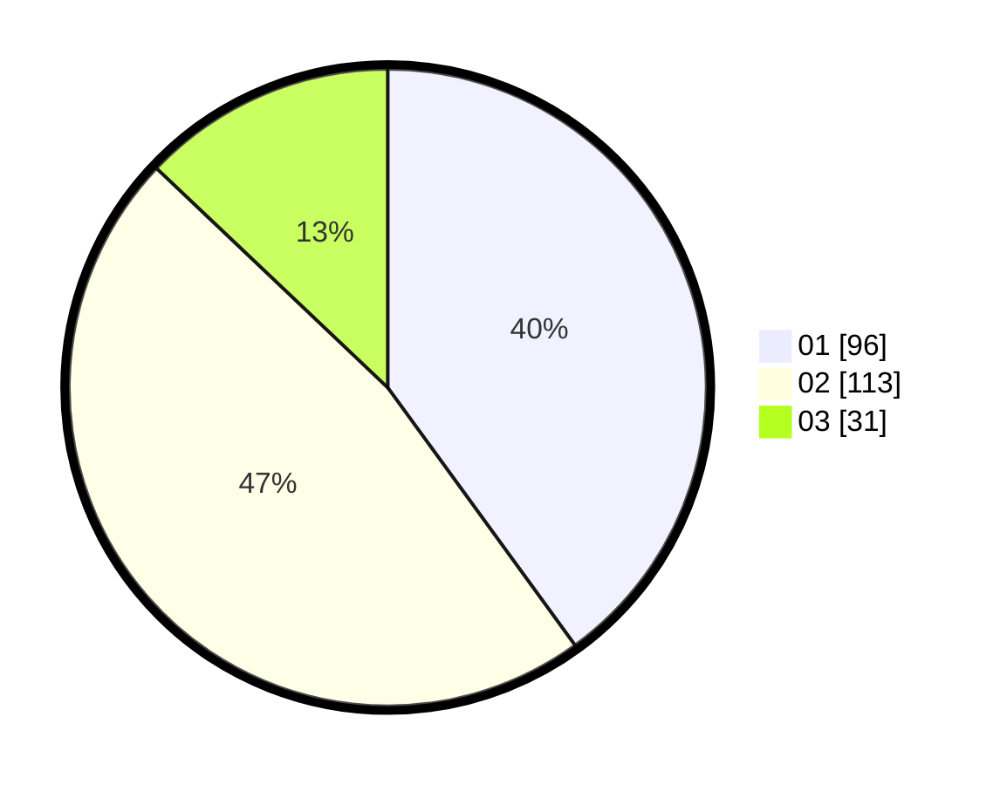

# Hasil

Hasil perolehan suara paslon dapat dilihat pada file paslon-01.txt, paslon-02.txt, dan paslon-03.txt.

Jika tidak ada, artinya data tersebut belum ada pada SIREKAP.

## Perolehan Suara

 * Paslon 01: **96**.
 * Paslon 02: **113**.
 * Paslon 03: **31**.

## Foto C Plano

https://sirekap-obj-formc.kpu.go.id/4fb5/pemilu/ppwp/31/74/10/10/03/3174101003141-20240215-214025--72158ee2-09e9-486b-8320-662b3eb78eac.jpg

https://sirekap-obj-formc.kpu.go.id/4fb5/pemilu/ppwp/31/74/10/10/03/3174101003141-20240215-214027--25702a48-01bf-48a5-b768-fd16b3c4281b.jpg

https://sirekap-obj-formc.kpu.go.id/4fb5/pemilu/ppwp/31/74/10/10/03/3174101003141-20240215-214026--f0cb0268-6695-49b6-bdd6-c976c545b293.jpg

## DATA PEMILIH TETAP

Jumlah pemilih dalam DPT: **277**.
 * L: **146**.
 * P: **131**.

## DATA PENGGUNA HAK PILIH

Jumlah pengguna hak pilih dalam DPT: **237**.
 * L: **121**.
 * P: **116**.

Jumlah pengguna hak pilih dalam DPTb: **5**.
 * L: **3**.
 * P: **2**.

Jumlah pengguna hak pilih dalam DPK: **2**.
 * L: **1**.
 * P: **1**.

Jumlah pengguna hak pilih: **244**.
 * L: **125**.
 * P: **119**.

## JUMLAH SUARA SAH DAN TIDAK SAH

JUMLAH SELURUH SUARA SAH: **240**.

JUMLAH SUARA TIDAK SAH: **4**.

JUMLAH SELURUH SUARA SAH DAN SUARA TIDAK SAH: **244**.
