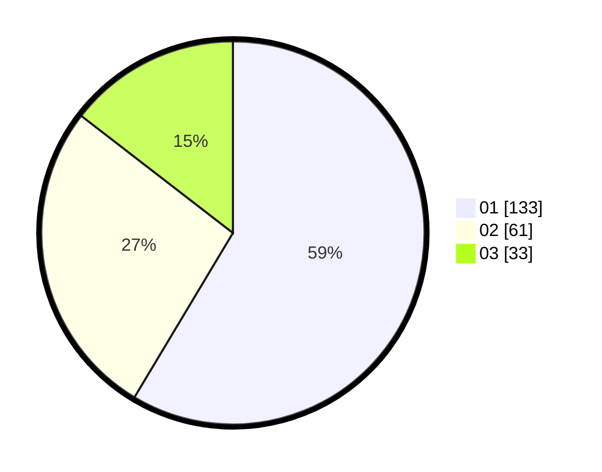

# Hasil

Hasil perolehan suara paslon dapat dilihat pada file paslon-01.txt, paslon-02.txt, dan paslon-03.txt.

Jika tidak ada, artinya data tersebut belum ada pada SIREKAP.

## Perolehan Suara

 * Paslon 01: **133**.
 * Paslon 02: **61**.
 * Paslon 03: **33**.

## Foto C Plano

https://sirekap-obj-formc.kpu.go.id/281d/pemilu/ppwp/31/74/10/10/03/3174101003142-20240215-214017--b14fa6a5-2cd9-4bfd-87ea-4e923ceeb528.jpg

https://sirekap-obj-formc.kpu.go.id/281d/pemilu/ppwp/31/74/10/10/03/3174101003142-20240216-014135--08566ad9-f212-4f0d-8b40-98957569edc8.jpg

https://sirekap-obj-formc.kpu.go.id/281d/pemilu/ppwp/31/74/10/10/03/3174101003142-20240215-214018--e2d59ca8-466d-453e-a634-df802097cc67.jpg

## DATA PEMILIH TETAP

Jumlah pemilih dalam DPT: **276**.
 * L: **141**.
 * P: **135**.

## DATA PENGGUNA HAK PILIH

Jumlah pengguna hak pilih dalam DPT: **231**.
 * L: **115**.
 * P: **116**.

Jumlah pengguna hak pilih dalam DPTb: **2**.
 * L: **1**.
 * P: **1**.

Jumlah pengguna hak pilih dalam DPK: **0**.
 * L: **0**.
 * P: **0**.

Jumlah pengguna hak pilih: **233**.
 * L: **116**.
 * P: **117**.

## JUMLAH SUARA SAH DAN TIDAK SAH

JUMLAH SELURUH SUARA SAH: **227**.

JUMLAH SUARA TIDAK SAH: **6**.

JUMLAH SELURUH SUARA SAH DAN SUARA TIDAK SAH: **233**.
