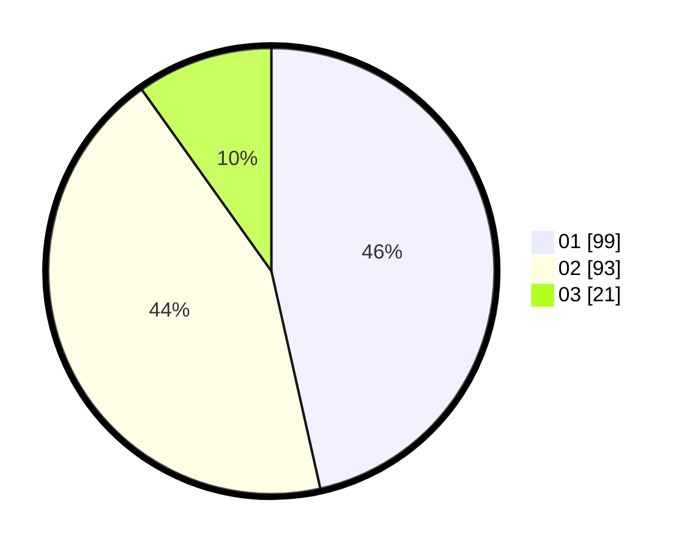

# Hasil

Hasil perolehan suara paslon dapat dilihat pada file paslon-01.txt, paslon-02.txt, dan paslon-03.txt.

Jika tidak ada, artinya data tersebut belum ada pada SIREKAP.

## Perolehan Suara

 * Paslon 01: **99**.
 * Paslon 02: **93**.
 * Paslon 03: **21**.

## Foto C Plano

https://sirekap-obj-formc.kpu.go.id/013d/pemilu/ppwp/31/74/10/10/03/3174101003143-20240215-021046--a8d163fa-efb9-4c5d-917d-fbd2afae04ed.jpg

https://sirekap-obj-formc.kpu.go.id/013d/pemilu/ppwp/31/74/10/10/03/3174101003143-20240215-020949--15356c93-8709-4a4f-9681-c788711b368b.jpg

https://sirekap-obj-formc.kpu.go.id/013d/pemilu/ppwp/31/74/10/10/03/3174101003143-20240215-021020--ae019665-5991-4845-ad1f-531bb0588681.jpg

## DATA PEMILIH TETAP

Jumlah pemilih dalam DPT: **286**.
 * L: **147**.
 * P: **139**.

## DATA PENGGUNA HAK PILIH

Jumlah pengguna hak pilih dalam DPT: **216**.
 * L: **105**.
 * P: **111**.

Jumlah pengguna hak pilih dalam DPTb: **1**.
 * L: **0**.
 * P: **1**.

Jumlah pengguna hak pilih dalam DPK: **2**.
 * L: **1**.
 * P: **1**.

Jumlah pengguna hak pilih: **219**.
 * L: **106**.
 * P: **113**.

## JUMLAH SUARA SAH DAN TIDAK SAH

JUMLAH SELURUH SUARA SAH: **213**.

JUMLAH SUARA TIDAK SAH: **6**.

JUMLAH SELURUH SUARA SAH DAN SUARA TIDAK SAH: **219**.
