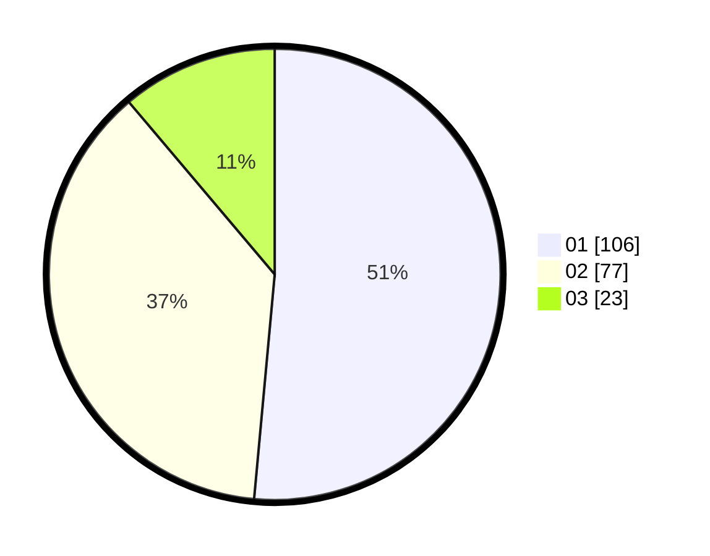

# Hasil

Hasil perolehan suara paslon dapat dilihat pada file paslon-01.txt, paslon-02.txt, dan paslon-03.txt.

Jika tidak ada, artinya data tersebut belum ada pada SIREKAP.

## Perolehan Suara

 * Paslon 01: **106**.
 * Paslon 02: **77**.
 * Paslon 03: **23**.

## Foto C Plano

https://sirekap-obj-formc.kpu.go.id/a4d9/pemilu/ppwp/31/74/10/10/03/3174101003145-20240216-212937--2aa38c7c-7946-43aa-83df-3b5e99a1deb2.jpg

https://sirekap-obj-formc.kpu.go.id/a4d9/pemilu/ppwp/31/74/10/10/03/3174101003145-20240216-212938--fe956210-ddce-4ca7-b1d5-a4bf1667e117.jpg

https://sirekap-obj-formc.kpu.go.id/a4d9/pemilu/ppwp/31/74/10/10/03/3174101003145-20240216-212938--ed46b581-756b-4b42-aa56-75549458295b.jpg

## DATA PEMILIH TETAP

Jumlah pemilih dalam DPT: **268**.
 * L: **129**.
 * P: **139**.

## DATA PENGGUNA HAK PILIH

Jumlah pengguna hak pilih dalam DPT: **207**.
 * L: **97**.
 * P: **110**.

Jumlah pengguna hak pilih dalam DPTb: **0**.
 * L: **0**.
 * P: **0**.

Jumlah pengguna hak pilih dalam DPK: **1**.
 * L: **1**.
 * P: **0**.

Jumlah pengguna hak pilih: **208**.
 * L: **98**.
 * P: **110**.

## JUMLAH SUARA SAH DAN TIDAK SAH

JUMLAH SELURUH SUARA SAH: **206**.

JUMLAH SUARA TIDAK SAH: **2**.

JUMLAH SELURUH SUARA SAH DAN SUARA TIDAK SAH: **208**.
