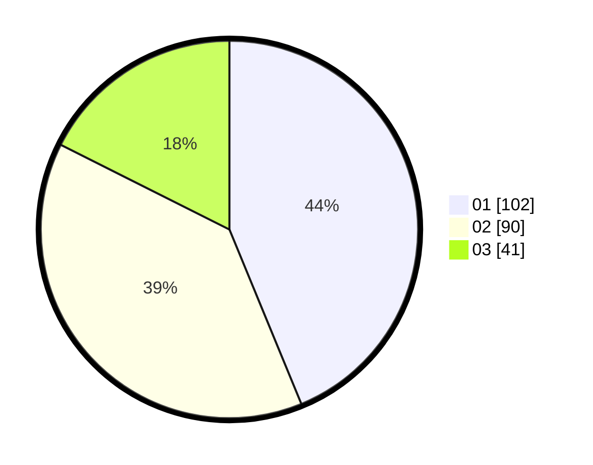

# Hasil

Hasil perolehan suara paslon dapat dilihat pada file paslon-01.txt, paslon-02.txt, dan paslon-03.txt.

Jika tidak ada, artinya data tersebut belum ada pada SIREKAP.

## Perolehan Suara

 * Paslon 01: **102**.
 * Paslon 02: **90**.
 * Paslon 03: **41**.

## Foto C Plano

https://sirekap-obj-formc.kpu.go.id/8f3f/pemilu/ppwp/31/74/10/10/03/3174101003148-20240215-210421--522c74ba-7f29-4370-9cad-f5deb2096dd9.jpg

https://sirekap-obj-formc.kpu.go.id/8f3f/pemilu/ppwp/31/74/10/10/03/3174101003148-20240215-210423--c2854230-dfc5-4d18-a5e1-b818e4f30c87.jpg

https://sirekap-obj-formc.kpu.go.id/8f3f/pemilu/ppwp/31/74/10/10/03/3174101003148-20240215-210422--2d16a043-5823-4315-a028-e59a256d18bf.jpg

## DATA PEMILIH TETAP

Jumlah pemilih dalam DPT: **282**.
 * L: **140**.
 * P: **142**.

## DATA PENGGUNA HAK PILIH

Jumlah pengguna hak pilih dalam DPT: **231**.
 * L: **112**.
 * P: **119**.

Jumlah pengguna hak pilih dalam DPTb: **1**.
 * L: **1**.
 * P: **0**.

Jumlah pengguna hak pilih dalam DPK: **3**.
 * L: **0**.
 * P: **3**.

Jumlah pengguna hak pilih: **235**.
 * L: **113**.
 * P: **122**.

## JUMLAH SUARA SAH DAN TIDAK SAH

JUMLAH SELURUH SUARA SAH: **233**.

JUMLAH SUARA TIDAK SAH: **2**.

JUMLAH SELURUH SUARA SAH DAN SUARA TIDAK SAH: **235**.
