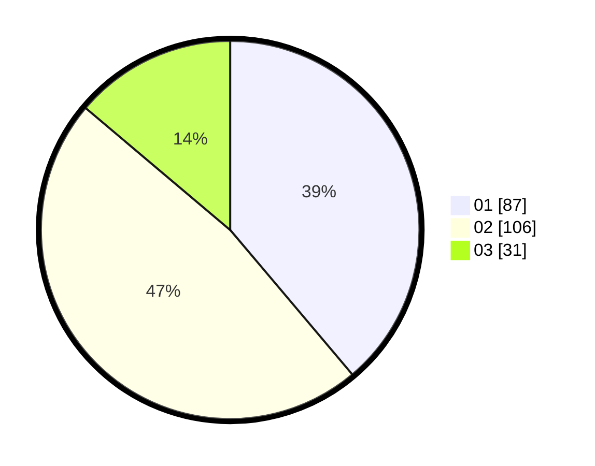

# Hasil

Hasil perolehan suara paslon dapat dilihat pada file paslon-01.txt, paslon-02.txt, dan paslon-03.txt.

Jika tidak ada, artinya data tersebut belum ada pada SIREKAP.

## Perolehan Suara

 * Paslon 01: **87**.
 * Paslon 02: **106**.
 * Paslon 03: **31**.

## Foto C Plano

https://sirekap-obj-formc.kpu.go.id/1322/pemilu/ppwp/31/74/10/10/03/3174101003151-20240216-211216--32c1f114-fafb-4247-828e-a30f8c0fb768.jpg

https://sirekap-obj-formc.kpu.go.id/1322/pemilu/ppwp/31/74/10/10/03/3174101003151-20240216-211217--ca6aaff4-075c-4159-bee1-57ee6da582ae.jpg

https://sirekap-obj-formc.kpu.go.id/1322/pemilu/ppwp/31/74/10/10/03/3174101003151-20240216-133431--e4495958-cae0-4664-af8d-9cd4c15c559a.jpg

## DATA PEMILIH TETAP

Jumlah pemilih dalam DPT: **272**.
 * L: **131**.
 * P: **141**.

## DATA PENGGUNA HAK PILIH

Jumlah pengguna hak pilih dalam DPT: **222**.
 * L: **104**.
 * P: **118**.

Jumlah pengguna hak pilih dalam DPTb: **5**.
 * L: **1**.
 * P: **4**.

Jumlah pengguna hak pilih dalam DPK: **1**.
 * L: **0**.
 * P: **1**.

Jumlah pengguna hak pilih: **228**.
 * L: **105**.
 * P: **123**.

## JUMLAH SUARA SAH DAN TIDAK SAH

JUMLAH SELURUH SUARA SAH: **224**.

JUMLAH SUARA TIDAK SAH: **4**.

JUMLAH SELURUH SUARA SAH DAN SUARA TIDAK SAH: **228**.
